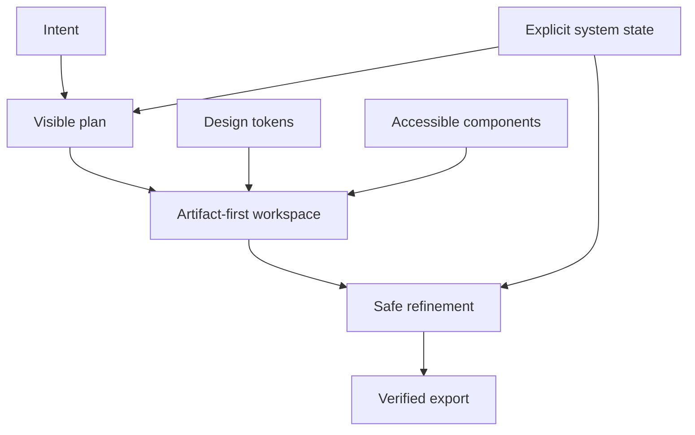

# Product design system

Status: approved baseline for the first product build.

This is the source of truth for UI decisions. Product screens may extend it only when the new pattern cannot be composed from an existing one. Reference research and adoption decisions are in [references.md](./references.md).

The purchased Align UI 2.0 Figma file `ugwpIV7ePpHMxDrQKafr2i` is the visual authority. FigureLab implements it through repository-owned `components/align/` primitives as the only generic component boundary. Product scope comes from `docs/production-build-spec.md`: Release 1 is Flowchart-first, while Illustration, Plot, Vector Canvas, Templates, and related route designs are preview/later until their ordered milestones pass.

## Design thesis

The product should feel like a calm scientific workspace with editorial clarity, not an AI generator dashboard.

**Calm precision** means:

- neutral surfaces let the figure dominate;
- every important state is explicit;
- controls appear near the object or decision they affect;
- one action receives primary emphasis at a time;
- density comes from alignment and progressive disclosure, not small unreadable UI;
- AI plans, costs, progress, and changes remain inspectable.



## Product personality

The interface is:

- calm, not playful;
- precise, not clinical;
- compact, not cramped;
- capable, not complicated;
- direct, not clever;
- trustworthy, not magical.

The visual baseline is **Align UI 2.0**: Inter, blue primary (`#335CFF`), Gray neutrals, 10px controls, 16–20px cards, and named regular shadows. Product IA stays a two-pane scientific workbench. Meaning comes from hierarchy, space, and one primary action — not gradients or decoration.

The product does not use graphite-only ChatGPT chrome, hairline-only elevation, system-font-only UI, glassmorphism, decorative blobs, glowing AI effects, emoji navigation, or constant animation as brand language.

## AI interaction policy

AI behavior must feel inspectable and interruptible:

- show operational activity such as reading a source, arranging a layout, or checking labels;
- never present private chain-of-thought as a product feature;
- pause for approval only when a choice materially changes content, evidence, cost, or layout;
- keep sources attached to the nodes and claims they support;
- place refinement actions beside the selected artifact object;
- keep cancel, retry, and edit paths available around long-running work;
- announce asynchronous changes through concise live-region text.

Beautiful UI is the reference for these interaction patterns. FigureLab reimplements them with its own semantic tokens and primitives; it does not introduce a second theme, icon set, or animation language.

## Technology decision

The design-system stack is:

- Tailwind CSS v4 for styling;
- repository-owned Align UI components with Radix primitives for accessible behavior;
- semantic CSS variables authored in OKLCH;
- Inter through `next/font` for the full product and marketing interface;
- system mono for code, dimensions, IDs, and reproducible values;
- Hugeicons Stroke Rounded for all interface icons (via `@/components/icons`); Align UI specifies Remix Icon, which remains a later pass;
- Motion only for purposeful transitions;
- assistant-ui primitives for thread/composer behavior;
- React Flow for the first flowchart canvas.

The repository currently already has Next.js 16.3.1, React 19, Tailwind v4, Inter, Hugeicons, and Motion. No second styling system, display font, or icon set should be introduced.

## Color system

### Color policy

- Align Gray neutrals are the default chrome language; blue is the filled primary.
- The filled primary action is Align blue with white text.
- Hover is `bg-weak-50`. Selection may use `primary-alpha-10`.
- Status in chrome may use Align success / warning / error tokens, paired with icon and label.
- Figure and plot colors belong to the document (`lib/flowchart/palette.ts`), not the application chrome.
- Meaning never depends on color alone.

### Light tokens

```css
:root {
  --background: oklch(1 0 0);
  --foreground: oklch(0.159 0 0);
  --sidebar: oklch(0.982 0 0);
  --muted: oklch(0.982 0 0);
  --muted-foreground: oklch(0.478 0 0);
  --border: oklch(0 0 0 / 0.102);
  --primary: oklch(0.159 0 0);
  --primary-foreground: oklch(1 0 0);
  --accent: oklch(0 0 0 / 0.051);
  --ring: oklch(0.159 0 0);
  --overlay: oklch(0 0 0 / 0.502);
}
```

### Dark tokens

```css
.dark {
  --background: oklch(0.178 0 0);
  --foreground: oklch(0.96 0 0);
  --sidebar: oklch(0.205 0 0);
  --muted: oklch(0.205 0 0);
  --muted-foreground: oklch(0.72 0 0);
  --border: oklch(1 0 0 / 0.1);
  --primary: oklch(0.96 0 0);
  --primary-foreground: oklch(0.178 0 0);
  --accent: oklch(1 0 0 / 0.05);
  --ring: oklch(0.96 0 0);
  --overlay: oklch(0 0 0 / 0.502);
}
```

### Verified text contrast

The proposed core pairs were converted to linear sRGB and checked with the WCAG contrast formula:

| Pair | Ratio |
| --- | ---: |
| Light graphite ink / paper | 18.1:1 |
| Light mid-ash / paper | 7.0:1 |
| Dark light-ink / dark canvas | 15.8:1 |
| Dark mid-ash / dark canvas | 7.5:1 |

All exceed WCAG AA for normal text. Component-level contrast still must be checked against the actual rendered background and state.

### Data visualization palette

Charts may use up to five stable series roles:

1. blue — primary observation;
2. coral — comparison or revenue/cost;
3. teal — positive secondary series;
4. violet — categorical secondary series;
5. amber — threshold or attention.

Large fills use low chroma/opacity; lines and marks carry the stronger color. Axes, labels, and values stay neutral. Every series is also distinguished by label, shape, or line style.

## Typography

### Typeface

- Interface, prose, and display: Inter (Align UI).
- Code, dimensions, task IDs, and reproducible snippets: the governed system-mono stack.
- No secondary brand or editorial font.
- Load Inter once through `next/font`; keep the mono role on the system-mono stack and keep root antialiasing enabled.

### Weights

- 400: body, descriptions, chat, inputs.
- 500: buttons, labels, navigation, and table headers.
- 500: Align titles (title-h5 / title-h6) and labels.
- 600: optional single page title only.
- Do not use 300 or 700+ in the product UI.

### Type scale

| Token | Size / line height | Use |
| --- | --- | --- |
| `text-caption` | 14 / 1.43 | timestamps, metadata, and hints |
| `text-meta` | 14 / 1.43 | secondary editor values |
| `text-ui` | 14 / 1.43 | buttons, menus, tabs, inspector labels |
| `text-body` | 16 / 1.5 | conversation, descriptions, mobile inputs |
| `text-title-sm` | 16 / 1.5 | pane labels that are not the page heading |
| `text-title` | 24 / 1.25 / 600 | page title and empty-state question |
| `text-display` | 24 / 1.25 / 600 | welcome heading only |

Rules:

- body reading measure is 60–75 characters;
- headings use balanced wrapping;
- short descriptions use pretty wrapping;
- changing credits, costs, time, zoom, dimensions, and progress use tabular numbers;
- long project names truncate only when the full value is available on focus/hover or rename;
- mobile inputs remain at least 16 px to prevent browser zoom.

## Spacing and layout

### Spacing scale

Use a 4 px base:

| Token | Value | Typical use |
| --- | ---: | --- |
| `space-1` | 4 px | icon/text optical correction |
| `space-2` | 8 px | items inside one control group |
| `space-3` | 12 px | adjacent compact controls |
| `space-4` | 16 px | standard component padding |
| `space-6` | 24 px | separation between groups |
| `space-8` | 32 px | page inset or major section gap |
| `space-12` | 48 px | empty-state or onboarding separation |

The gap between groups must be at least twice the gap inside the group. Use whitespace before adding dividers.

### App shell

```text
┌──────────────────────────────────────────────────────────────────────┐
│ Sidebar │ Project header: name · save state · undo/redo · export   │
│         ├──────────────┬────────────────────────────┬───────────────┤
│ History │ Versions     │ Canvas / artifact          │ Inspector     │
│         │              │                            │               │
│ Account ├──────────────┴────────────────────────────┴───────────────┤
│         │ Composer: request · sources · cost · apply                │
└──────────────────────────────────────────────────────────────────────┘
```

Initial desktop dimensions:

- global sidebar: 248 px expanded, 56 px collapsed;
- project header: 52 px;
- versions rail: 216 px when visible;
- inspector: 296 px default, resizable from 264–360 px;
- conversation/composer reading width: 760 px maximum;
- standard page inset: 24 px compact desktop, 32 px large desktop;
- canvas consumes all remaining space.

These are initial content constraints, not device-class breakpoints. Adjust only when real content proves a boundary is wrong.

### Responsive states

1. **Expanded:** global sidebar, canvas, and inspector fit together.
2. **Compact desktop:** sidebar becomes icon rail; versions merge into a popover/rail; inspector remains resizable.
3. **Tablet:** navigation and inspector become drawers; canvas remains full-width.
4. **Mobile:** creation and review use a single-column flow; canvas tools move into labeled bottom sheets. Do not shrink a desktop editor until it technically fits.

The application must reflow at 320 px and survive 200% zoom without losing critical actions.

## Shape, borders, and elevation

### Radius scale

The system uses one radius family with a small number of roles. This preserves consistent geometry without forcing pills, fields, nested surfaces, and dialogs to share one literal radius.

| Token | Value | Use |
| --- | ---: | --- |
| `radius-xs` | 4 px | small selection markers |
| `radius-sm` | 6 px | compact tags and code fragments |
| `radius-md` | 8 px | menu items and compact fields |
| `radius-lg` | 10 px | buttons, cards, nav, composer, dialogs |
| `radius-xl` | 10 px | bounded surfaces and media |
| `radius-2xl` | 16 px | links |
| `radius-composer` | 10 px | main conversational composer |
| `radius-round` | 9999 px | account / login CTA only |

Nested radii must be concentric: outer radius equals inner radius plus padding. Do not put 12 px children inside a 12 px parent.

Supported browsers may progressively enhance bounded surfaces with `corner-shape: squircle`. Normal `border-radius` remains the production fallback because `corner-shape` is not yet Baseline across major browsers.

### Borders

- 1 px borders communicate structure, focus, or selection.
- Main page sections should not become a grid of outlined cards.
- Canvas pane boundaries may use one neutral structural border.
- Generated images use a 1 px black 10% outline in light mode and white 10% outline in dark mode.

### Shadows

- Align regular / input / overlay shadows on cards, menus, dialogs, and the composer;
- tooltip uses strong fill plus `shadow-tooltip`;
- no raw Tailwind `shadow-lg` / `shadow-2xl` and no colored glow.

## Icons

- Hugeicons Stroke Rounded only, imported from `@/components/icons`.
- Standard icon size: 16 px inside compact UI, 18 px in normal buttons, 20 px for standalone toolbar controls.
- Default optical weight is a 1.5 stroke with round caps and joins. Do not use Fill, Solid, Sharp, or chromatic icons.
- Stroke Rounded is default; fill marks the active tool only where the icon supports it cleanly.
- Icons inherit `currentColor`.
- Icon-only actions require an accessible label and tooltip.
- Prefer visible labels for unfamiliar scientific or export actions.

## Controls

### Button hierarchy

- **Primary:** one per control group; neutral filled surface.
- **Secondary:** neutral outline or subtle surface.
- **Ghost:** low-emphasis toolbar and message actions.
- **Destructive:** red only for genuinely destructive actions.
- **Link:** inline navigation or documentation.

Text buttons use 10px corners. The account / login CTA is the only pill: white fill plus a hairline border. Icon-only buttons share the 10px control radius. Joined button groups may keep connected inner edges so they read as one control.

Desktop controls target 40 × 40 px when space permits; compact toolbar controls may visually use 32–36 px while preserving at least a 24 × 24 px non-overlapping hit target. Touch targets aim for 44 × 44 px.

On coarse-pointer devices, shared button, toggle, select, menu-item, and command-item primitives expand their interactive target to at least 44 px. Full-screen application shells use `safe-area-shell` so content avoids notches, rounded display corners, and home-indicator regions.

Button copy is verb-first and includes the consequence when it matters:

- `Generate figure · 50 credits`
- `Apply change · 10 credits`
- `Export SVG`
- `Delete project`

### Fields and composer

- Every field has a persistent visible label unless its accessible purpose is unmistakably established by the surrounding composite widget.
- Placeholder text provides an example, never the only label.
- The main composer grows to a defined maximum height, then scrolls internally.
- Attachments appear above the text row as removable items.
- Mode and output settings use compact labeled disclosures, not an always-visible wall of pills.
- Submit remains available until validation; errors appear inline and focus the first invalid input.

### Tabs

- Use tabs only for peer views of the same object.
- Active state uses text weight plus a shape/indicator, not color alone.
- Arrow keys move within the tablist; Tab exits the widget.
- Do not use pills as both filters and navigation in the same surface.

### Menus and command palette

- Menus contain actions; links navigate.
- Destructive items are separated and explicitly labeled.
- Escape closes and focus returns to the trigger.
- Command palette uses `Cmd/Ctrl+K` and exposes navigation plus expert actions, not settings that only exist there.

## Surface patterns

### Empty workbench

- centered question at 24 px / 400;
- composer raised slightly above vertical center;
- at most three realistic examples below;
- no illustration, feature grid, or dashboard before the first task;
- navigation remains available but visually quiet.

### Active project

- artifact is dominant;
- conversation is collapsible or width-limited;
- project title and save state stay visible;
- selection opens contextual inspector content;
- composer remains the language path for scoped changes;
- versions are durable milestones, while undo/redo handles recent direct edits.

### Generation progress

Use named stages and a stable live region:

1. Reading your request
2. Planning the layout
3. Rendering the figure
4. Checking labels and output

Show elapsed time and a range based on comparable jobs. Never use a fake precise countdown. Display the structural preview as soon as it exists.

### Cards

Cards are for bounded objects such as a project preview, export preset, or source file. They are not default layout containers. Never nest cards.

### Tables and data

- quiet horizontal separators only;
- labels align to the start, numbers to the end;
- changing values use tabular numbers;
- column headers use 14 px / 500;
- row actions appear on focus as well as hover;
- narrow layouts switch to a meaningful list instead of shrinking every column.

## Motion

- hover/color response: 80–120 ms;
- standard state transition: 180 ms;
- pane or modal transition: 220 ms;
- easing: `cubic-bezier(0.2, 0, 0, 1)`;
- press feedback: scale to exactly `0.96` when appropriate;
- contextual icon swap: 300 ms spring with zero bounce if Motion is used;
- no `transition: all`;
- no page-load entrance animation for routine app screens;
- no custom animation on repeated canvas operations;
- reduced motion replaces translation/scale with short opacity changes.

Motion always has a static cue such as text, color, icon, or state label.

## Accessibility contract

The core prompt-to-export flow must be keyboard-completable.

- Native elements first; no clickable `div`.
- Visible `:focus-visible` indicator with at least a 2 px perimeter.
- One main landmark and coherent headings.
- Skip-to-content before repeated navigation.
- Escape closes overlays; focus is trapped and restored for modals.
- Selection, save state, progress, completion, and errors are announced without stealing focus.
- The canvas exposes a navigable object list and keyboard movement path.
- Color is paired with icon, text, shape, or line style.
- Toasts with actions or errors remain until dismissed.
- Forced colors, RTL, 200% zoom, 320 px reflow, and reduced motion are required QA states.

## Voice and writing

### Voice

- warm in onboarding and empty states;
- neutral in routine work;
- calm and specific in errors;
- serious around deletion, billing, rights, and data loss.

### Rules

- sentence case everywhere;
- address the reader as `you` only when instruction needs a subject;
- use the same term for the same object: project, figure, version, source, export;
- links name their destination;
- buttons name their action;
- errors explain recovery beside the failing surface;
- no `Oops`, `Magic`, `Let's go`, or vague `Something went wrong`;
- no exclamation marks in errors or billing.

Examples:

| Context | Copy |
| --- | --- |
| Empty projects | `No figures yet` / `Create your first figure` |
| Auto ratio | `Auto · 16:9 for this layout` |
| Save | `Saved just now` |
| Offline | `Offline — changes are stored on this device` |
| Refunded failure | `Unable to render the figure. Your 50 credits were returned. Try again.` |
| Export warning | `Two labels may be too small at the selected journal width.` |

## Component inventory

### P0 — before the first workflow

- Button and icon button
- Link
- Tooltip
- Field, label, input, textarea, file attachment
- Select/combobox
- Tabs
- Dropdown and context menu
- Dialog and alert dialog
- Drawer/sheet
- Toast/status region
- Progress and skeleton
- Empty state
- Sidebar and navigation item
- Resizable panes
- Command palette
- Project header
- Composer
- Message and message action bar
- Generation status
- Credit/cost disclosure
- Canvas toolbar
- Inspector section
- Version item
- Export preset and readiness issue

### P1

- Data table
- Search and filter bar
- Before/after comparison
- Comments and mentions
- Share dialog
- Color and style controls
- Object tree

No component is complete until default, hover, focus, active, disabled, loading, error, empty, and dark states are defined where applicable.

## Governance

1. Use an existing primitive before creating a new one.
2. Add semantic tokens for new roles; never borrow a color because it looks similar.
3. Keep variants small and meaningful.
4. Document new patterns beside the component.
5. Test at 320 px, normal desktop, 200% zoom, keyboard-only, light, dark, and reduced motion.
6. Review motion at slowed playback when adding animation.
7. Reject one-off radius, font size, shadow, or raw color values unless the exception is documented.
8. Run `npm run design:audit` to reject hard-coded colors, raw palette utilities, extra font weights, raw shadow scales, arbitrary spacing, and `transition-all`.

## Implementation order

1. Establish repository-owned Align primitives backed by accessible headless behavior.
2. Replace the starter global colors with these semantic tokens.
3. Map the type, spacing, radius, and motion tokens into Tailwind v4.
4. Build and visually test primitive states in isolation.
5. Build the application shell and empty workbench.
6. Add assistant-ui thread/composer behavior with our styling.
7. Add the React Flow canvas inside the stable editor shell.
8. Verify the real prompt → preflight → preview → refine → export flow.

Do not build marketing pages, billing dashboards, or template marketplaces before this foundation has been exercised in the real editor.
