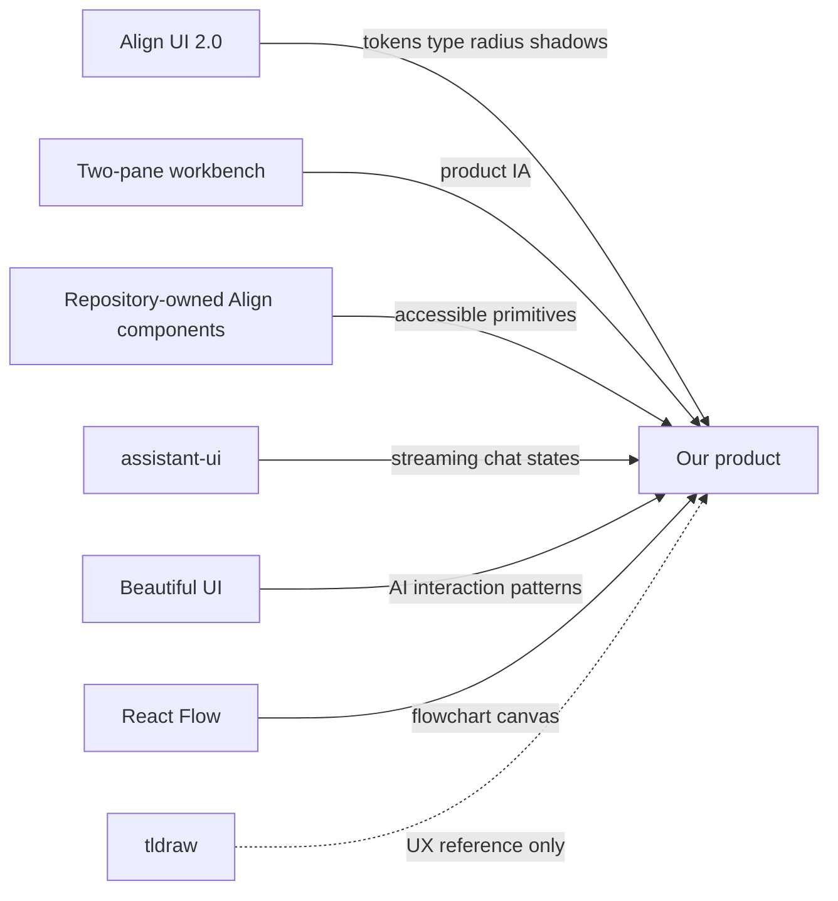

# Design references and template decisions

Research date: 2026-08-19.

This is a decision record, not a mood board. References are separated into what we will adopt, what we will adapt, and what we will deliberately avoid.

## Reference synthesis

## Primary references

### Align UI 2.0

Reference: [Align UI](https://www.alignui.com/) and Figma file `ugwpIV7ePpHMxDrQKafr2i`.

Decision: **adopt the purchased Align UI Figma file as the visual source of truth for tokens, type, radius, shadows, control anatomy, and assets.** Keep FigureLab product IA as a two-pane, Flowchart-first Release 1 shell. Implement the kit through repository-owned `components/align/` components backed by accessible headless behavior; do not recreate a parallel primitive boundary. Illustration, Plot, Vector Canvas, and Templates remain preview/later.

### Design-trust checklist

Reference: [“The $1M App Design Playbook” by Jake Castillo](https://x.com/jakecastilloooo/status/2090096767723307361)

Decision: **adopt the system discipline and funnel-priority advice, translated for a web application.**

Useful recommendations now encoded in FigureLab:

- one application typeface with two working weights; display personality stays in marketing;
- a 4 px spacing base with no arbitrary component spacing;
- semantic color tokens and no raw color literals or palette utilities;
- one documented radius family instead of unrelated one-off corners;
- Hugeicons Stroke Rounded as the only interface icon family and one tokenized elevation scale;
- visible hover, focus, active, disabled, loading, error, and selected states;
- tabular numerals, safe-area support, conventional navigation, and 44 px coarse-pointer targets;
- a root `DESIGN.md`, automated `design:audit`, reference research, and a repeatable QA checklist;
- polish prioritized around public proof, onboarding/upgrade, and the first successful figure before low-frequency settings.

Web translation and caveats:

- SF Pro, React Native `borderCurve`, native haptics, App Store screenshots, and iOS tab bars are platform-specific. FigureLab uses Align UI Inter, CSS safe-area insets, accessible state feedback, conventional web navigation, and homepage/social-product demonstrations.
- CSS `corner-shape: squircle` is a progressive enhancement only because it remains experimental and is not Baseline across major browsers.
- “One border radius everywhere” is too literal for concentric nested geometry and pill controls. We adopt one governed radius family with explicit roles.
- The article's conversion benchmarks and causal claims are operator observations, not validated targets for this product. FigureLab will define and test its own funnel baselines.

This reference strengthens governance; it does not replace the product-specific visual direction established below.

### 0. Energy

Reference: [Energy](https://getenergy.com/)

Decision: **primary visual reference for the marketing layer and overall craft standard.**

The live site was inspected on 2026-08-19. Its useful design language is:

- editorial serif display type paired with restrained sans-serif UI;
- a nearly white technical field with a quiet dotted grid;
- blue used for one emphasized word, the primary CTA, focus, and selection;
- a floating but simple navigation surface;
- large, real product-interface demonstrations instead of decorative dashboard cards;
- low-chroma atmospheric depth without glassmorphism or neon effects.

Adopt the clarity, spacing, technical field, real-product proof, and single-blue emphasis. Adapt its controls to Align UI's 10px control radius and governed shape roles. Do not copy Energy's mascot, typography assets, wording, illustrations, or exact layouts.

### 1. ChatGPT-style conversation shell

Practical reference: [assistant-ui ChatGPT clone](https://www.assistant-ui.com/examples/chatgpt)

The live ChatGPT interface was inspected on 2026-08-19. Its conversation ergonomics remain useful, but FigureLab's visual authority is Align UI 2.0: Inter, compact 10px controls, and a 20px nested composer card.

The assistant-ui example explicitly mirrors the current ChatGPT layout and documents the useful details:

- centered empty-state composer;
- shared composer between empty and active thread states;
- sticky composer after the conversation begins;
- tooltipped controls;
- mutually exclusive send/stop/dictation states;
- restrained black, white, and neutral surfaces;
- compact message actions and clear mutually exclusive input states; geometry follows Align UI rather than ChatGPT.

Adopt:

- the centered prompt as the primary empty state;
- one persistent composer rather than separate “create” and “edit” forms;
- quiet global chrome and a content-width conversation column;
- controls that reveal detail through tooltips;
- clear send, stop, and retry states.

Adapt:

- the composer must show mode, source attachments, resolved settings, cost, and the primary action without becoming a crowded toolbar;
- the generated figure becomes the dominant artifact, not a large chat transcript;
- user requests should be compact rows or bubbles, while system plans and job stages use structured status UI.

Avoid:

- copying ChatGPT branding or exact colors;
- hiding editor operations inside chat;
- reproducing a general-purpose conversation product when the real job is figure creation.

### 2. DataFast

References: [DataFast product site](https://datafa.st/) and [live dashboard demo](https://datafa.st/demo)

The live dashboard was visually inspected and its computed styles sampled on 2026-08-19. In the observed dark appearance it used:

- DM Sans;
- 16 px / 24 px default text;
- 14 px / 20 px, weight 500 controls;
- 8 px control radii;
- approximately 21 px large-surface radii;
- 32 px main page inset;
- dark neutral surfaces separated mostly by low-opacity 1 px edges;
- color concentrated in data, change direction, and selection rather than general decoration.

Adopt:

- decisive hierarchy with little explanatory chrome;
- tabular numbers for costs, credits, timings, dimensions, and zoom;
- dense information that remains readable because alignment is consistent;
- a small number of large surfaces instead of nested cards;
- quiet borders and semantic color.

Adapt:

- use less rounding in the editor shell because canvas panes are structural rather than promotional cards;
- reserve DataFast-style rounded surfaces for bounded previews, export summaries, and modals;
- keep charts directly labeled and accessible instead of using decorative avatars or novelty marks.

Avoid:

- card grids for every editor property;
- dark mode as the only polished appearance;
- copying its coral/blue chart palette as brand identity.

### 3. Repository-owned Align components

References: the Align UI Figma file and the exact MCP inventory in [`align-mcp-inventory.md`](./align-mcp-inventory.md).

Decision: **FigureLab owns its Align component source in `components/align`.** Radix, cmdk, Sonner, Vaul, and resizable panels may remain behind those public components when they provide necessary accessible behavior.

Why it fits:

- the visual contract comes directly from the complete Align UI 2.0 kit;
- component source remains editable and reviewable in the repository;
- semantic CSS variables map directly onto the Align token system;
- React 19 and Tailwind v4 behavior stays under FigureLab's control;
- Sidebar, Command Menu, Modal, Drawer, Tooltip, Field, Empty State, Progress, Tabs, and Toast can share one coherent ownership model.

Do not import a dashboard template wholesale. Product Navigation and AI Product frames are composition references, while FigureLab's canvas-first information architecture remains authoritative.

### 4. assistant-ui

References: [assistant-ui](https://www.assistant-ui.com/) and [official examples](https://www.assistant-ui.com/examples)

Decision: **use assistant-ui primitives for the conversational thread and composer**, styled entirely with our design tokens.

Why:

- MIT-licensed React primitives;
- streaming, cancellation, retries, attachments, message actions, and thread state are already modeled;
- examples include ChatGPT-like chat and a side-by-side artifact pattern;
- it reduces the risk of building visually convincing but fragile streaming behavior.

Boundary:

- assistant-ui owns conversation behavior;
- our app owns project state, credit rules, generation jobs, figure plans, canvas state, and visual styling;
- no assistant-ui cloud dependency is required for the initial product.

### 5. Beautiful UI

References: [Beautiful UI](https://www.beautifului.dev/) and [MIT license](https://www.beautifului.dev/license)

Decision: **adopt selected AI-native interaction patterns, rebuilt in our design system.**

The live catalog and Prompt Bar source were inspected on 2026-08-19. The catalog covers twenty focused patterns, including loading and thinking states, approvals, tool activity, task rows, prompt entry, context cards, flowcharts, fine-tuning controls, and selection actions. The source is copy-paste React/Tailwind code and the site grants use under the MIT license.

Adopt now:

- visible operational activity that combines loading, task rows, and tool chips;
- approval cards when ambiguity materially changes the generated artifact;
- source context cards that connect evidence to figure nodes;
- selection actions positioned beside the active canvas object;
- the Prompt Bar's `@` source and `/` command interaction model when the composer is connected to real capabilities.

Adapt:

- call the progress disclosure “Activity,” not hidden model reasoning; expose actions and evidence, not chain-of-thought;
- map every pattern to FigureLab's semantic tokens, Hugeicons Stroke Rounded icons, accessible headless behavior, governed Align UI shape roles, and exact `.96` press scale;
- keep the interface static by default and animate only state changes the user initiated;
- preserve the artifact-first layout instead of turning the product into a generic chat interface.

Avoid copying verbatim:

- the custom `bg-surface` / `text-ink` / `shadow-raised` theme layer;
- the component-local inline SVG icon system;
- self-running demo sequences;
- the Prompt Bar's optional `glimm` WebGL rainbow sweep unless research shows it improves comprehension;
- code patterns that create nested or non-native interactive semantics.

This keeps Beautiful UI as the interaction grammar while this repository remains the implementation source of truth.

### 6. Vercel Chatbot

References: [Vercel Chatbot template](https://vercel.com/templates/other/chatbot) and [template announcement](https://vercel.com/blog/introducing-chatbot)

Decision: **architecture reference only; do not clone it into this repository.**

Useful patterns:

- durable thread routing;
- streaming response lifecycle;
- attachment storage;
- chat history;
- server actions and structured tool results.

Why not use it as the base:

- this repository already exists and uses Next.js 16.3.1;
- the template brings authentication, database, storage, and provider opinions before the editor loop exists;
- our primary object is a project and artifact, not only a chat thread.

### 7. React Flow

References: [React Flow](https://reactflow.dev/) and [examples](https://reactflow.dev/examples)

Decision: **use React Flow for the first editable flowchart canvas.**

Why:

- MIT license;
- built-in pan, zoom, drag, selection, keyboard node movement, and deletion;
- custom nodes and edges;
- save/restore and interaction examples;
- fits the first-release flowchart scope better than a general whiteboard SDK.

Boundary:

- React Flow is the flowchart scene engine, not our design system;
- nodes, toolbars, selection, inspectors, context menus, and empty states use our components and tokens;
- illustration raster editing can use a separate focused surface later without forcing both modes into one scene model.

### 8. tldraw

References: [tldraw SDK](https://tldraw.dev/), [starter kits](https://tldraw.dev/starter-kits/overview), and [license](https://tldraw.dev/community/license).

Decision: **use as a UX and interaction reference only. Do not make it a production dependency yet.**

The SDK is strong: canvas performance, selection, copy/paste, history, shapes, customization, AI canvas starters, and multiplayer. However, its current default license permits development only; production requires a trial, commercial, or hobby license key. This creates cost and dependency risk before the product validates its core flow.

Revisit only if its commercial terms are justified by collaboration or advanced whiteboard requirements.

### 9. Open Canvas

Reference: [LangChain Open Canvas](https://github.com/langchain-ai/open-canvas)

Decision: **do not use.**

Its artifact versioning and chat-plus-editor separation are useful references, but the repository was archived on 2026-02-26 and carries a much broader LangGraph/Supabase architecture than this product needs.

## Template shortlist

| Rank | Source | Use | Decision |
| --- | --- | --- | --- |
| 1 | Align UI 2.0 Base Components | Buttons, fields, overlays, sidebar, resizable panes, command menu | Adopt as repository-owned component source |
| 2 | Beautiful UI | AI activity, approvals, source context, selection actions | Adopt patterns, rebuild with our tokens |
| 3 | assistant-ui thread/composer | Streaming conversation and attachments | Adopt, restyle completely |
| 4 | React Flow starter and MIT examples | Editable flowchart canvas | Adopt for flowchart MVP |
| 5 | Align Product Navigation | Collapsible navigation behavior | Adapt relevant composition only |
| 6 | Vercel Chatbot | Durable chat architecture | Study, do not clone |
| 7 | assistant-ui artifacts example | Chat plus artifact relationship | Study and simplify |
| 8 | DataFast live demo | Density, spacing, data hierarchy | Visual reference only |
| 9 | tldraw chat/agent starter kits | Canvas interaction ideas | Reference only; production license required |

## Final reference formula

**Energy editorial clarity + Align UI ownership + DataFast precision + Beautiful UI interaction grammar + assistant-ui behavior + React Flow canvas.**

No single external template is the product. The design system in [README.md](./README.md) is the source of truth.
