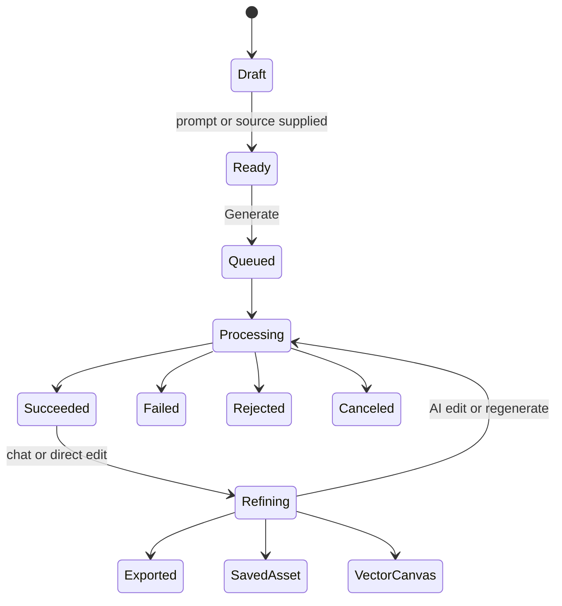

# Generation and editing workflows

## Shared creation loop

The terminal statuses are verified on the public API page. Whether the web app exposes exactly the same status names is an inference.

## Live Illustration generation — verified

A real text-to-Illustration request was exercised on 2026-08-19:

1. A non-sensitive PCR workflow prompt enabled Generate.
2. `Ctrl+Enter` submitted the request.
3. Generate changed to disabled `Generating…`.
4. The browser navigated to `/project/{projectId}` within roughly ten seconds.
5. The chat showed `Message received, Analyzing user input...` and then `Analyzing your textual description.`
6. An Image Analyzer narrative described the intended composition while rendering continued.
7. A generated figure appeared after approximately 55 seconds total.
8. The credit balance fell from 200 to 150, proving a 50-credit charge for this successful 1K generation.

The inspected default settings were Nano Banana Pro, Flat, and Auto. The completed result reported Nano Banana Pro · 16:9 · Flat, proving that Auto resolved to 16:9 for this prompt. The selected image reported 560×313 in the canvas UI.

## Illustration mode — published

Accepted starting points:

- plain-language text prompt;
- uploaded PDF, Word, or TXT document;
- sketch or whiteboard photo;
- lab photo or existing image;
- reference image to match style/layout;
- damaged or low-quality figure to enhance.

Published generation settings:

- model selector;
- 20+ color presets plus palette extraction from a reference;
- style presets: Flat, 2.5D, 3D, Sketch, Line-Art, Hand-Drawn;
- visual consistency reference that locks icons, arrows, fonts, and overall style;
- aspect ratio.

Published models:

- GPT Image 2 and GPT Image 1.5;
- Nano Banana Pro, Nano Banana 2, Nano Banana;
- Seedream 5.0 Lite and Seedream 4.5;
- Sora;
- Flux.2 Max.

Model access varies by plan. The pricing/docs naming contains spelling/version drift and should be treated as provider configuration, not hard-coded UI.

Refinement actions:

- conversational iteration with prior context;
- compare multiple versions of one prompt;
- Region Redraw on a selected area;
- Text Edit on recognized text;
- Recolor with preset or extracted palette;
- White background removal;
- aspect-ratio adjustment;
- upscale to 2K, 4K, or 8K;
- regenerate.

## Flowchart mode — verified/published

Verified starting UI:

- prompt textarea;
- attachment/upload;
- ratio picker;
- recommended templates and category filters.

Published accepted inputs:

- text;
- sketch;
- reference figure;
- preset template.

Published processing behavior:

- AI maps logic into a flowchart;
- auto-layout arranges nodes and spacing;
- generated result remains editable;
- AI chat can refine the result.

Published template families include standard flowcharts, model architecture, cycle diagrams, timelines, PRISMA, CONSORT, and fishbone diagrams. Only the first four category families were visible in the inspected default UI.

Direct edit actions:

- drag nodes;
- edit text inline;
- adjust connectors;
- multi-select;
- add/remove boxes;
- global font-size adjustment;
- switch color themes or grayscale;
- duplicate or delete selected elements.

## Plot mode — published

Accepted data:

- CSV;
- Excel;
- pasted tabular text.

Flow:

1. Upload/paste data.
2. Preview the parsed dataset.
3. Choose plot type, journal style, and palette.
4. Generate a publication-ready plot.
5. Refine labels, colors, chart type, axes, layout, annotations, or style through AI chat.
6. Optionally assemble finished figures into a multi-panel layout.
7. Export an image/vector/document or download Python code.

The marketing examples show PCA, volcano, heatmap, stacked-bar, and standard scatter/bar outputs. The product page also names box plots, survival curves, dose responses, cohort comparisons, biomarker plots, and time-course figures as target use cases; these are claims, not verified chart-type controls.

## Project persistence — published

- A generation session is automatically saved as a Project.
- A Project retains conversation history and generated images.
- A saved individual image may be organized in Library.
- A vectorized output may become a Vector Canvas document.
- A secure share link can expose the conversation and image read-only, optionally password protected.

The live test additionally verified that the project route and session shell exist during processing, not only after completion. It also verified a per-thread session history control and a `Start new chat` action inside the same project canvas.

## API workflow — published

The public API is asynchronous:

1. `POST /v1/images/generations` with `mode: "generations"`, prompt, and optional sources.
2. Persist returned `task_id`.
3. Poll `GET /v1/tasks/{task_id}`.
4. Stop on `succeeded`, `failed`, `rejected`, or `canceled`.
5. Download the output URL within seven days.

Published capability families:

- text-to-figure;
- sketch-to-figure;
- reference-to-figure;
- enhance;
- flowchart;
- upscale;
- vectorize.

The API claims automatic routing within one generation mode and says failed/rejected tasks are not billed.
