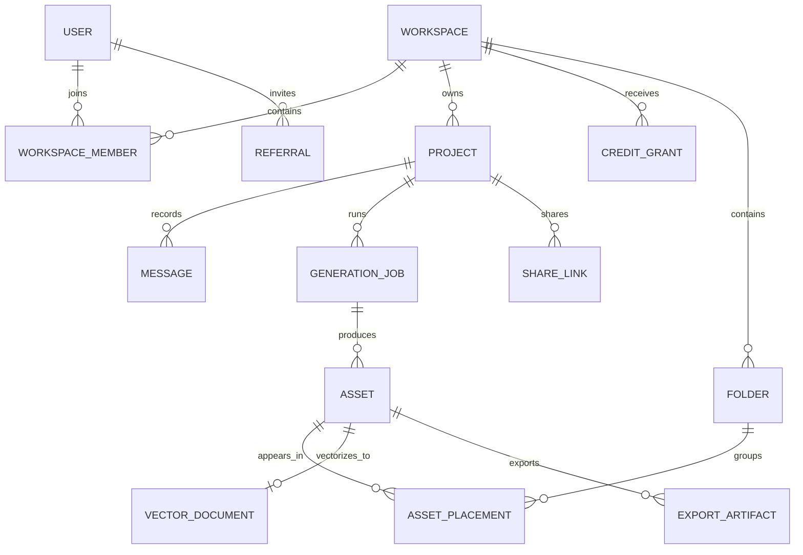

# Build model and parity checklist

This file is an implementation inference based on the observed product. It is not a claim about FigureLabs internals.

## Recommended domain model

Suggested records:

- `User`: identity, profile, personal workspace.
- `Workspace`: personal/team, plan, storage quota.
- `WorkspaceMember`: role and status.
- `Project`: mode, title, status, timestamps, preview asset.
- `Message`: actor, content, attachments, generation/edit intent.
- `GenerationJob`: capability, provider/model, settings, status, cost, error, timing.
- `Asset`: raster/vector/data/document, dimensions, storage key, metadata, favorite state.
- `Folder` and `AssetPlacement`: Library organization without forcing one-folder-only assets.
- `VectorDocument`: serialized editable scene plus source asset and version.
- `ExportArtifact`: format, resolution, job, expiry, certificate link.
- `CreditGrant`: source, amount, remaining, expiry.
- `CreditSpend`: job/export reference and amount.
- `ShareLink`: token hash, password hash, permissions, expiry/revocation.
- `Referral`: inviter, invite code, invitee, qualification/reward state.

## Suggested service boundaries

- Auth/profile.
- Workspace/team membership.
- Project/conversation persistence.
- Upload/storage pipeline.
- Generation orchestration and provider adapters.
- Editor document persistence/versioning.
- Export/vectorization workers.
- Credit ledger and entitlements.
- Billing/invoice integration.
- Library/search/folders.
- Referrals and reward qualification.
- Sharing/password protection.
- Notifications.

## Job and credit invariants

- Idempotency key on every generation/edit/export submission.
- Reserve credits before expensive work; settle on success.
- Release reservations for failed/rejected jobs.
- Define canceled-job policy explicitly.
- Persist provider request IDs and normalized failure reasons.
- Never rely on client-side credit balance for authorization.
- Consume the earliest-expiring eligible grant first.
- Store output URLs internally; vendor API download links may expire.

## Practical build order

### Phase 1 — functional core

- Shell and route structure.
- Mode-aware workbench with prompt/source input.
- Projects with durable conversation history.
- Asynchronous job state and mocked provider adapter.
- One real end-to-end flowchart generation path.
- Editable flowchart scene with save and basic exports.

### Phase 2 — data visualization

- CSV/Excel/paste ingestion.
- Dataset preview and validation.
- Plot specification and deterministic render.
- Conversational plot mutations.
- PNG/SVG/PDF and reproducible code export.

### Phase 3 — illustration/media operations

- Model/provider selection.
- Reference and style inputs.
- Region editing, text editing, recolor, background, ratio, upscale.
- Raster export variants.

### Phase 4 — asset system and monetization

- Library folders/favorites/search.
- Vector Canvas documents.
- Entitlements, ledger, plan/top-up purchase.
- Publication certificate.
- Sharing.
- Teams and referrals.

## Observable parity checklist

### Shell

- [ ] Global rail and header are consistent on every route.
- [ ] Active route and keyboard focus are visible.
- [ ] Credit balance updates after a settled action.
- [ ] Notifications and account menus work.

### Workbench

- [ ] Illustration, Flowchart, and Plot preserve independent drafts.
- [ ] Generate stays disabled until valid input exists.
- [ ] Upload validation and accepted types are explicit.
- [ ] Aspect ratio persists into the job.
- [ ] Templates support preview, use, and direct-edit intents.

### Projects/assets

- [ ] A completed generation appears in Projects without refresh.
- [ ] Reopening restores all messages and outputs.
- [ ] Saving one image to Library does not duplicate the whole project.
- [ ] Folder, favorite, search, sort, grid, and list states are durable.
- [ ] Vectorization creates a re-openable editable document.

### Editors

- [ ] Undo/redo spans direct edits and is version-safe.
- [ ] Multi-select, move, resize, duplicate, delete, and text edit work.
- [ ] Global themes do not destroy local overrides unexpectedly.
- [ ] Save, autosave, and unsaved-state behavior are explicit.
- [ ] Exports reopen correctly in target tools.

### Credits/billing

- [ ] Failed/rejected jobs are not charged.
- [ ] Reservations recover after crashes/timeouts.
- [ ] Daily, monthly, top-up, referral, and rollover grants expire correctly.
- [ ] Entitlements match plan server-side.
- [ ] Invoice/cancel/upgrade read-backs match the provider.

### Security/privacy

- [ ] Uploads are private by default.
- [ ] Share passwords are hashed and links are revocable.
- [ ] Signed URLs expire.
- [ ] Team access is enforced at query and storage layers.
- [ ] Delete account/team flows state retention and irreversible scope clearly.

