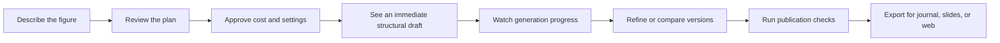

# UI/UX advantage strategy

This document turns the FigureLabs production audit into a product strategy for our build. It is an implementation recommendation, not a claim about FigureLabs internals.

## The advantage in one sentence

**Move researchers from intent to a trustworthy, publication-ready figure with less uncertainty at every step.**

The winning experience should not merely look cleaner than FigureLabs. It should make five things obvious:

1. what the system understood;
2. what it will make;
3. how long it will take and what it will cost;
4. what changed between versions;
5. whether the result is actually ready to use.



## Where FigureLabs leaves room to win

These opportunities are grounded in the production audit completed on 2026-08-19.

| Observed behavior | User cost | Our advantage |
| --- | --- | --- |
| The live generation took about 55 seconds and showed broad analyzer messages rather than a precise job plan. | The wait feels opaque and users cannot tell whether the system understood the request. | Show the interpreted figure structure immediately, then expose named job stages and a useful preview while the final render runs. |
| The successful default generation consumed 50 credits; the balance changed from 200 to 150 after completion. | The financial consequence is learned after the action. | Show the exact cost before submission, reserve it visibly, and release it automatically on failure. |
| `Auto` silently resolved to 16:9. | An important layout decision is hidden until after generation. | Resolve automatic choices in preflight and let the user accept or change them before spending. |
| The project view combines chat/session controls, a broad canvas toolbar, AI actions, and export actions. | Users must discover which surface owns each action. | Keep one stable editor shell and show only tools relevant to the current selection and task. |
| The analyzer narrates the composition, but it is not a compact editable specification. | The explanation consumes space without giving direct control. | Turn interpretation into an editable outline: sections, labels, arrows, palette, style, and output target. |
| Versions can be regenerated, but the inspected UI did not make branching or side-by-side comparison obvious. | Iteration risks losing a good state or repeating expensive work. | Make every AI change a named version with compare, restore, duplicate, and branch. |
| Export capabilities and plan/credit promises differ across official surfaces. | Users cannot confidently predict what they will receive or pay. | Make entitlements, output properties, and costs derive from one server-backed source of truth. |
| Projects intermittently remained on `Loading workspace...` before recovering. | A persisted project can feel lost. | Use explicit sync states, local recovery, retry, and last-saved timestamps. |
| Several inspected controls were custom tabs/popovers with weak keyboard behavior in the accessibility bridge. | Keyboard and assistive-technology use is fragile. | Treat keyboard completion, focus visibility, semantic controls, and reduced motion as product features. |
| “Publication-ready” is marketed as an output quality, but no visible readiness checklist was observed. | The user still has to inspect dimensions, labels, contrast, and format manually. | Make readiness measurable and fixable before export. |

## Product principles

### 1. Show the plan before spending

Generation begins with a compact preflight, not a blind submit. It should display:

- interpreted figure type and structure;
- detected labels, steps, groups, and relationships;
- model, visual style, palette, and resolved aspect ratio;
- expected output size;
- exact credit cost and estimated time;
- source files and any parse warnings.

The preflight is directly editable. The primary action should be `Generate figure · 50 credits`, not a generic arrow button.

For simple requests, preflight can be a one-line confirmation with an `Edit plan` disclosure. Complexity should reveal more controls; it should not make every user configure everything.

### 2. Make progress useful

Do not use one indeterminate spinner for a minute-long job. Use four truthful stages:

1. `Reading your request`
2. `Planning the layout`
3. `Rendering the figure`
4. `Checking labels and output`

As soon as planning finishes, place a structural draft on the canvas. Even boxes and connectors are useful because they confirm the system's interpretation and give the user something to inspect.

If timing cannot be predicted accurately, do not show a fake countdown. Show elapsed time, the current stage, and a range learned from comparable jobs.

### 3. Keep one clear editor model

Use a stable four-region layout:

```text
┌─────────────────────────────────────────────────────────────────────┐
│ Project name     Saved just now       Undo  Redo       Export       │
├───────────────┬───────────────────────────────────┬─────────────────┤
│ Versions      │                                   │ Inspector       │
│               │              Canvas               │                 │
│ v4 Current    │                                   │ Selection tools │
│ v3            │                                   │ or figure plan  │
│ v2            │                                   │                 │
├───────────────┴───────────────────────────────────┴─────────────────┤
│ Ask for a change…                    Attach    Cost preview   Apply │
└─────────────────────────────────────────────────────────────────────┘
```

- **Top bar:** project state, save state, undo/redo, and the main export action.
- **Leading rail:** versions and branches, not a second global navigation system.
- **Canvas:** the dominant work surface.
- **Inspector:** contextual properties for the selection; figure-wide plan when nothing is selected.
- **Composer:** natural-language changes with the expected cost shown before apply.

The expanded desktop layout should remain intact while it genuinely fits. On narrower screens, the versions rail and inspector become explicit drawers. The canvas remains primary; critical actions stay in stable chrome and never fall below a clipped pane.

### 4. Make AI and direct manipulation equal partners

Every important action should have a direct path and, where useful, a language path.

| Goal | Direct interaction | Language interaction |
| --- | --- | --- |
| Rename a label | Select and edit text | “Rename denaturation to heat separation” |
| Reorder steps | Drag nodes | “Move purification before amplification” |
| Change visual style | Choose a style in the inspector | “Make this suitable for a Nature methods figure” |
| Fix one region | Select region and redraw | “Simplify the highlighted cell membrane” |
| Add a citation note | Add a note field | “Add source note under panel B” |

Chat must not become a hiding place for basic editor functions. Direct changes should update the same version history as AI changes.

### 5. Make iteration safe

Every generation or AI edit creates a version automatically. The versions rail should support:

- auto-generated change summaries;
- before/after comparison;
- restore without destroying later work;
- duplicate and branch;
- clear indication of direct edits after the last generated version;
- cost attached to each paid operation.

Autosave should show `Saving…`, `Saved just now`, `Offline — changes stored on this device`, or a specific recovery action. Never leave save state implicit in a long-running creative workflow.

### 6. Turn export into a goal, not a file menu

Start with the destination:

- `Journal manuscript`
- `Presentation`
- `Web or social`
- `Continue editing elsewhere`

Then recommend the right format and settings. The export center should show:

- file format and whether it remains editable;
- pixel dimensions or physical dimensions;
- DPI where relevant;
- color mode and background behavior;
- font embedding or text-outline behavior;
- expected file size;
- plan entitlement and any credit cost;
- warnings with one-click fixes.

Examples of specific actions: `Export SVG`, `Export 300 DPI PNG`, `Download editable PPTX`, and `Copy Python code`. Avoid one ambiguous `Download` action.

### 7. Make “publication-ready” verifiable

The product should run a visible readiness check before export:

- labels fit and remain legible at the target size;
- no text is clipped or overlaps another element;
- contrast meets the selected use case;
- raster assets meet the requested resolution;
- fonts and vector elements will survive the chosen format;
- required panel labels are present and ordered;
- source/citation notes are present when the user marked them as required;
- AI-generated or licensed asset disclosure is available when needed.

The result should be `Ready`, `Ready with warnings`, or `Needs fixes`. Each issue must name the affected element and offer a direct fix. This is stronger than a vague quality score.

## North-star creation flow

### Step 1 — Start

- A single visible label: `Describe the figure`.
- Example placeholder: `Show a three-step PCR workflow from sample collection to analysis`.
- Source actions use names, not only icons: `Add file`, `Add reference image`, `Paste data`.
- Mode selection changes the examples and accepted inputs but preserves the draft when switching modes.

### Step 2 — Review plan

- Show a concise outline, resolved settings, cost, and timing.
- Highlight assumptions such as `Auto selected 16:9 because the workflow is horizontal`.
- Primary action: `Generate figure · 50 credits`.
- Secondary action: `Edit plan`.

### Step 3 — Generate

- Create the project route immediately.
- Show a structural draft as soon as it exists.
- Preserve the original prompt and source list.
- Let the user leave safely; notify them when the job finishes.

### Step 4 — Refine

- Selection opens contextual tools in the inspector.
- The composer supports scoped changes using the current selection.
- Costed actions preview their cost; free direct edits say `No credits` only when that distinction matters.
- Undo/redo and version history remain separate: undo handles recent local operations, versions handle durable milestones.

### Step 5 — Validate and export

- Choose the destination.
- Run readiness checks automatically.
- Fix warnings in context.
- Export and verify that the artifact opens correctly in the selected target.

## Copy system

Use sentence case and verb-first action labels. Name consequences, costs, and recovery steps.

| Weak or ambiguous | Recommended copy |
| --- | --- |
| `Generate` | `Generate figure · 50 credits` |
| `Auto` | `Auto · 16:9 for this layout` |
| `Generating…` | `Rendering the figure · usually 30–60 sec` |
| `Something went wrong` | `Unable to render the figure. Your 50 credits were returned. Try again.` |
| `Export` as an unexplained menu | `Choose export format` |
| `No projects` | `No figures yet` + `Create your first figure` |
| `Save` with no state | `Saved just now` |
| `Upscale` | `Upscale to 4K · 20 credits` |

## Visual design direction

The visual advantage should come from hierarchy and responsiveness, not decoration.

- Let the canvas dominate; supporting panes should be quiet and collapsible.
- Group with space before adding separators or cards.
- Use one emphasis color for selection, active generation, and the primary action.
- Prefer labeled actions to dense rows of icon-only controls.
- Keep structural borders subtle; use them only when they communicate pane boundaries, selection, or focus.
- Use outline icons by default and filled state only for the active tool.
- Use motion to preserve context: a selection inspector can slide/fade in, but routine canvas actions should feel immediate.
- Give buttons tactile press feedback without making the editor feel animated for its own sake.

Do not copy FigureLabs' pale-blue/navy styling. A visual skin is easy to imitate and gives no durable advantage. The durable design language is **calm precision**: fewer controls at once, explicit system state, and strong document hierarchy.

## Accessibility as product quality

- Every task from prompt entry through export must be keyboard-completable.
- Tabs, menus, dialogs, and toolbars must use native semantics and predictable focus order.
- Every icon-only control needs an accessible name and visible tooltip; common actions should also expose labels at first use.
- The canvas needs a navigable object list as a non-spatial alternative.
- Selection, errors, save state, generation progress, and completion must be announced without stealing focus.
- Pointer targets must remain usable at compact editor density.
- Zoom, reflow, text growth, RTL, high contrast, and reduced motion are test states, not future enhancements.

## Build priorities

| Priority | Capability | Why it creates advantage |
| --- | --- | --- |
| P0 | Editable preflight with resolved ratio, cost, and expected time | Removes uncertainty before the first paid action. |
| P0 | Immediate structural preview plus truthful progress stages | Makes the longest wait understandable and useful. |
| P0 | Stable canvas, contextual inspector, and scoped composer | Reduces tool discovery and keeps attention on the figure. |
| P0 | Autosave, recovery, and version history | Makes experimentation safe. |
| P0 | Destination-based export with artifact verification | Completes the real job instead of ending at a download button. |
| P1 | Compare, restore, duplicate, and branch | Turns iteration into a controllable workflow. |
| P1 | Publication readiness checks | Creates a concrete reason to choose us over a generic image generator. |
| P1 | Keyboard command palette and navigable object list | Makes expert use faster and accessibility stronger. |
| P2 | Collaboration, comments, and share review | Valuable after the single-user creation loop is excellent. |
| P2 | Large template/community system | Discovery should not distract from building a trustworthy editor. |

## What not to build first

- A large dashboard before the prompt-to-export workflow works end to end.
- Dozens of model and style pills shown simultaneously.
- AI-only editing for operations users expect to perform directly.
- A template marketplace before generated output is reliably editable.
- Decorative motion, oversized cards, or icon-only toolbars used as a substitute for hierarchy.
- A “publication-ready” badge without explicit checks.
- Plan and credit copy stored separately across marketing, billing, and product UI.

## Success metrics

The north-star metric should be **completed, usable exports per active creator**, not generations or credits spent.

Supporting measures:

- time to first meaningful structural preview;
- prompt-to-export completion rate;
- generation abandonment rate;
- percentage of jobs with cost confirmed before submission;
- failed-job charge/refund accuracy;
- average paid generations before a usable export;
- percentage of exports that pass readiness checks;
- percentage of exported files that open successfully in the target tool;
- recovery rate after interrupted or offline sessions;
- keyboard-only completion rate for the core flow.

## Definition of the first winning release

The first release is differentiated when a user can:

1. describe one flowchart or scientific workflow;
2. review the interpreted structure, resolved format, cost, and timing;
3. approve generation and see a structural preview quickly;
4. refine the result through both canvas actions and scoped language edits;
5. compare or restore versions without losing work;
6. run concrete publication checks;
7. export a verified SVG and 300 DPI PNG;
8. reopen the project and recover the full state.

If this loop is not excellent, adding more models, templates, teams, referrals, or dashboards will not create a defensible UX advantage.
