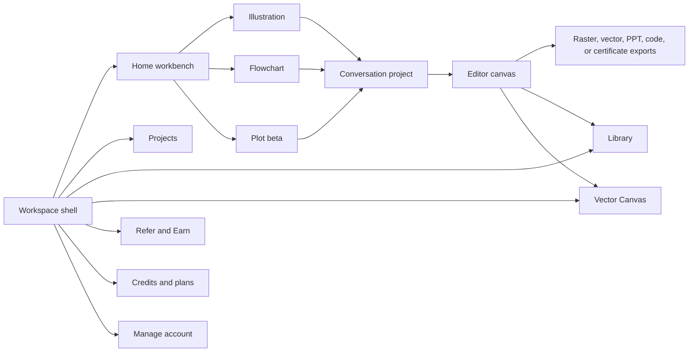

# FigureLabs production research

Observed on 2026-08-19 against the signed-in workspace at `chat.figurelabs.ai` and the public product site at `www.figurelabs.ai`.

This folder is the build baseline for the local FigureLabs-inspired product. It separates:

- **Verified production behavior** — observed directly in the signed-in workspace.
- **Published behavior** — claimed by FigureLabs pricing, help, product, API, or tutorial pages.
- **Inference** — an implementation recommendation or likely data model, explicitly labeled as such.

Do not treat marketing copy as proof that a feature works exactly as described. Current contradictions are collected in [07-open-questions-and-contradictions.md](./07-open-questions-and-contradictions.md).

## Document map

1. [Product and route map](./01-product-and-route-map.md)
2. [Screen specifications](./02-screen-specifications.md)
3. [Generation and editing workflows](./03-generation-and-editing-workflows.md)
4. [Editors, canvas, and exports](./04-editors-canvas-and-exports.md)
5. [Plans, credits, rights, and teams](./05-plans-credits-rights-and-teams.md)
6. [Build model and parity checklist](./06-build-model-and-parity-checklist.md)
7. [Open questions and contradictions](./07-open-questions-and-contradictions.md)
8. [Research log and sources](./08-research-log-and-sources.md)
9. [UI/UX advantage strategy](./09-ux-advantage-strategy.md)

## Product topology

## Core product idea

FigureLabs combines three creation modes inside one conversational workbench:

- scientific illustration from text, documents, sketches, photos, or references;
- editable research flowcharts from prose, references, or templates;
- publication-style plots from CSV, Excel, or pasted data.

The shared loop is **input → asynchronous generation → conversational refinement → direct editing → export → asset management**.

## Confidence convention

- `Verified` means observed in the authenticated production UI.
- `Published` means stated on an official FigureLabs page but not necessarily exercised.
- `Inference` means proposed for our build and must not be described as current FigureLabs behavior.
