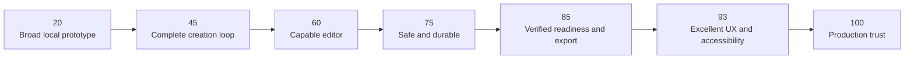

# FigureLab 20 → 100 product plan

Status: execution roadmap

Baseline: 2026-08-24

Scope: Flowchart-first Release 1, with Align UI 2.0 as the visual system

## Executive decision

The current application is a broad, capable local prototype, not a coherent production product. The user-provided score of **20/100** is therefore a useful planning baseline, not a scientific measurement.

The fastest path to 100 is not another full-surface redesign and not more feature breadth. It is one complete, trustworthy workflow:

> Describe the figure, approve the plan, edit every part, export a verified result, and reopen the same editable project.

Release 1 is **Flowchart-first**. Plot, Illustration, Vector Canvas, broad sharing, templates, PDF/PPTX, teams, and billing do not earn core points until they reuse the same production project, version, job, asset, permission, and export contracts.

Align UI is the visual foundation throughout the work. It is not a final polish phase. Figma defines visual anatomy; the FigureLab product contracts define behavior; accessibility requirements define interaction.

## What “100” means

One hundred does not mean “every imagined feature exists.” It means the Release 1 promise is complete and proven:

1. A new user can reach an editable result without assistance.
2. The system shows an editable interpretation, resolved settings, duration, and cost before generation.
3. Job state is truthful and survives reloads and worker restarts.
4. Direct edits and language-directed edits modify one canonical document without losing either copy.
5. Autosave, offline recovery, conflicts, versions, compare, and restore are safe.
6. Readiness issues select the exact affected object and offer a direct fix.
7. SVG and 300 DPI PNG download, open, validate, and match the selected revision.
8. Reopening the project restores the full editable state.
9. Authorization, storage, uploads, sharing, and APIs are secure by default.
10. The core workflow passes keyboard, screen-reader basics, 320px, 390px, 200% zoom, light, dark, reduced-motion, failure, and recovery QA.
11. Production logs, funnel events, alerts, backups, restoration, retention, deletion, and support paths work.
12. The actual deployed smoke test passes; local tests alone are not completion evidence.

Points are awarded only when a phase's entire exit gate is demonstrated. Partial implementation, hidden routes, catalog specimens, mocks presented as live behavior, and passing unit tests do not earn the gate.

## Current reality

The repository already contains meaningful work:

- a strong local Flowchart editor and deterministic readiness/export logic;
- fixture and Gemini generation adapters, planning, polling, retry, cancellation, and idempotency paths;
- IndexedDB projects, revisions, recovery, and named versions;
- substantial early Plot, Illustration, Vector Canvas, Library, Template, Share, and public API slices;
- an inventoried Align UI Figma source and repository-owned `components/align` primitives;
- 28 unit-test files and 165 currently passing unit tests.

But the product still has foundational gaps:

- persistence is browser-local rather than PostgreSQL-backed and cross-device;
- jobs can fall back to process memory and are not reliably restart-durable;
- authentication, workspaces, object-level authorization, and object storage are absent;
- current sharing and public API behavior are demo-grade, not safe production contracts;
- current PPTX output is a raster image on a slide, not a natively editable drawing;
- the narrow Playwright tests do not prove the complete prompt-to-reopen journey;
- visual rules are documented, but exact Figma parity has not been approved through baseline screenshots and full state matrices.

This is why the application can feel feature-rich and still score 20: breadth is visible, but trust and completion are not.

## Execution update — 2026-08-24

The first production slice is implemented and verified:

- Phase 0 now has one Flowchart-first contract across the running app, `DESIGN.md`, this roadmap, the production specification, and the Align inventory. Illustration and Plot are labeled Preview; Vector Canvas and Templates remain later surfaces.
- Shadcn's public boundary is gone: no `components/ui`, `components.json`, Shadcn imports, or Shadcn package references remain in application, component, library, test, design-system, or production-spec sources. Accessible Radix/cmdk/Sonner behavior may remain behind `components/align`.
- Global Search no longer crashes when opened repeatedly from Projects.
- AI revisions snapshot a semantic base document and preserve newer manual edits. Viewport-only movement does not create a false conflict.
- Mobile project actions are reachable from one labeled action sheet; React Flow controls, connection handles, and selected-node add actions measure 44×44 screen pixels at 390px.
- Projects and Library filtered-empty states name the query, hide irrelevant sort/layout controls, and provide a working `Clear search` recovery.
- Project routes expose one real `h1`, file inputs have distinct accessible labels, and the flowchart application label uses the current project title.
- The live local golden task passed prompt, editable plan, approval, generation, direct edit, autosave, reload, safe concurrent AI revision, Library save, share creation, and read-only share rendering in the Codex inline browser.
- Required gates pass: 28 test files / 165 tests, design audit, ESLint, TypeScript production build, diff whitespace check, and Playwright discovery of 9 E2E tests.

Phase 1 is **not** closed yet. Remaining exit-gate work includes one deterministic automated golden E2E, actual downloaded SVG and 300 DPI PNG byte validation in-browser, cost/source disclosure in preflight, generation stop-action consolidation, 320px and keyboard-only completion, and server-backed durability beyond one browser.

## Live UX blockers observed on 2026-08-24

These are not optional polish items. They block task completion and must be assigned to the earliest phase that owns the underlying contract.

| Blocker | User impact | Owning phase | Acceptance gate |
| --- | --- | --- | --- |
| Opening global Search from Projects can trigger the route error boundary with `undefined (reading 'subscribe')`. | The main discovery control makes projects appear lost. | Phase 1 | Search opens from every route, supports typing/arrow/select/Escape/focus restore, and survives 100 open/close cycles with no console error, error boundary, or state loss. |
| A generated Illustration can be tiny or clipped on desktop and effectively blank on mobile. | The result exists but the user cannot inspect or edit it. | Preview quarantine, then expansion | Every supported mode immediately fits the complete result; at least 60% of the editor work area belongs to the canvas; toolbars use one row plus overflow. |
| Mobile Flowchart auto-fit makes labels microscopic; connection targets can be 9×9px and instructions describe desktop-only gestures. | Touch users cannot perform the core edit. | Phases 2 and 5 | At 390px labels are legible, targets are at least 44×44px, tap/edit/connect/delete/undo/save/export work without double-click, Shift, or Delete-key dependencies. |
| Mobile hides actions such as Save to Library, Generate Figure Image, and Import without moving them to overflow. | Capabilities disappear by viewport. | Phase 5 or feature quarantine | Every supported desktop action is reachable through visible mobile controls or one labeled action sheet; unsupported preview actions are explicitly removed from both. |
| Pages have missing/duplicate `h1`s, unnamed inspector controls, duplicate field labels, button-based navigation, and repeated non-specific template action names. | Keyboard and screen-reader users cannot reliably understand or complete tasks. | Phase 5 | Exactly one page heading, zero unnamed controls, unique labels and action names, links for navigation, predictable focus, and full keyboard completion. |
| Vector Canvas empty state shows search/sort/layout and then a second empty state below the fold. | First-time users see unusable controls and competing starts. | Preview quarantine, then expansion | Empty collections show one heading, one explanation, one primary action, one secondary action; filtering/sorting chrome appears only when useful. |
| Generation exposes both `Cancel` and `Stop generating`, elapsed time can jump, and user copy leaks implementation language. | Stop behavior and progress truth are unclear. | Phase 1 | One stop action, one monotonic clock, plain-language stages, same-job resume after refresh, and explicit recoverable cancellation. |
| The shell can read as a square sidebar slab beside an unrelated rounded workspace. | The first impression looks assembled rather than system-designed. | Align contract and Phase 5 | The exact approved Figma composition is reproduced: one clipped outer shell, inherited outer corners, continuous gutter, concentric pane radius, and no doubled seam. |
| The 22-template mobile catalog becomes a roughly 9,324px stack with repeated generic CTAs. | Discovery is slow and action identity is ambiguous. | Preview quarantine, then expansion | A named template can be found and opened within 30 seconds at 390px; sticky search/type controls and compact cards preserve unique action names. |
| Filtered empty states keep irrelevant sort/layout controls and offer no query-specific recovery. | Users may think their content disappeared. | Phase 1 and expansion | Name the query, provide `Clear search`, preserve the query, restore results immediately, and apply the pattern consistently. |

The live audit covered Home, Projects, one generated Illustration project, the demo Flowchart project, Library, Templates, and Vector Canvas at 1280×720 and 390×844. It did not prove every route or browser.

## Phase 0 — freeze product truth before more implementation

Score change: none. This phase prevents us from earning fake points in the wrong direction.

### Work

1. Make Flowchart the documented and implemented Release 1 default, unless the owner explicitly changes the release strategy.
2. Reconcile `DESIGN.md`, `docs/production-build-spec.md`, research docs, routes, homepage copy, navigation, and tests around that one decision.
3. Mark every current feature `Core`, `Preview`, `Internal`, or `Deferred`. Preview routes must not imply production guarantees.
4. Inventory every visible control and route. Each control must be functional, intentionally disabled with a reason, or removed.
5. Define one golden task and fixture source that is used for product, visual, accessibility, recovery, and export QA.
6. Record the approved desktop and mobile shell geometry from exact Figma nodes before touching the shell again.
7. Resolve owner decisions that block later phases: hosting/region, PostgreSQL, object storage, auth methods, model/data-retention policy, upload limits, pricing/credits, share-link defaults, retention/deletion, and support ownership.

### Exit gate

- One R1 journey exists across all authoritative docs and the running app.
- No route, default mode, label, test, or milestone contradicts that journey.
- Every shipped feature has an honest maturity label.
- The golden task and evidence checklist are committed.

## Align UI implementation contract

Figma access is already available. The source file is complete; missing access is not a blocker.

### Authority order

1. Exact Align UI Figma node for visual anatomy and states.
2. FigureLab product contract for information architecture and behavior.
3. Accessible headless behavior for keyboard, focus, menus, dialogs, and announcements.
4. Repository-owned `components/align` public components for implementation.

Radix, cmdk, or Sonner may remain as invisible behavior dependencies where useful. They are not Shadcn. Shadcn-generated styling, `components/ui`, `components.json`, Shadcn imports, Shadcn naming contracts, and Shadcn documentation must be gone.

### Exact source map

| FigureLab surface | Align source |
| --- | --- |
| Product shell | AI Product desktop `191042:2379`; mobile frames under the AI Product page |
| Sidebar | AI sidebar `191050:3104`; product navigation variants `3802:11759` |
| Prompt composer | Prompt Area `191226:4236`; Text Area; File Upload; Select; Button |
| Project headers | Page Header `3829:27898`; Breadcrumbs; Button Group; Badge |
| Editor controls | Button Group; Dropdown; Popover; Tooltip; Tabs; Segmented Control |
| Plan review | Modal/Drawer; Text Input; Text Area; Checkbox/Radio; Alert |
| Generation state | Progress; Alert/Toast; File Upload progress-card anatomy |
| Projects and Library | AI Projects examples; Search; Empty State; Card/Table only when appropriate |
| Readiness and export | Modal/Drawer; Select; Input; Checkbox; Alert; Progress |

### Parity rules

- Capture source and implementation side by side at 1440×900, 390px, and 320px.
- Cover default, hover, focus, active, selected, disabled, loading, error, empty, and dark states for every used family.
- Use Figma variables through semantic tokens; do not copy raw colors or arbitrary radii into consumers.
- Audit icons against the Figma source. Align uses Remix glyphs; every Hugeicons substitution must be visually equivalent or replaced by an exact asset.
- Make pane geometry deliberate. The AI Product reference uses an inset main pane; if that pattern is used, reproduce the complete root clipping, gutter, and concentric radii. A square rail next to a partially clipped, oversized rounded pane is rejected as a broken hybrid.
- Add visual baselines for the shell, prompt, navigation, header, modal, input, empty state, editor, plan, and export flow.
- Keep `/components` as the state catalog, but approve components in their real product flow as well.
- Make `design:audit` fail on `components/ui`, `components.json`, Shadcn imports, raw colors, arbitrary radii/shadows, unexplained icon packages, duplicate primitives, and missing state specimens.

Align parity is continuous: every phase below must use approved components on the surfaces it changes.

## Phase 1 — 20 → 45: complete the real creation loop

Outcome: a new user can finish the core Flowchart journey without dead ends or simulated functionality.

### Build

1. **Start:** one dominant `Describe the figure` action, labeled source actions, useful examples, and preserved drafts when switching allowed inputs.
2. **Preflight:** interpreted goal, orientation, structure, assumptions, sources, expected time, resolved settings, and cost are editable before approval.
3. **Approve:** create the project immediately and begin exactly one idempotent job.
4. **Progress:** expose named durable stages, elapsed time, cancel, retry, and safe navigation away; never show a fake countdown.
5. **Structural draft:** show the editable node/edge plan as soon as planning completes.
6. **Direct edit:** change labels, nodes, edges, positions, layout, and visual properties.
7. **Language edit:** apply a scoped change against a saved base revision; never overwrite newer manual edits silently.
8. **Completion:** autosave, create a version, run readiness, export SVG/PNG, close, and reopen.
9. Remove or honestly disable every control that does not participate in a working path.

### UX standard

- One stable canvas-first shell owns the workflow.
- Primary actions say what happens and, when relevant, what it costs.
- Canvas, inspector, versions, and composer each have one clear responsibility.
- Empty, loading, success, partial, failure, cancelled, offline, and recovery states are designed—not improvised after errors.

### Exit gate

The golden E2E journey passes from prompt through plan, approval, draft, keyboard edit, language edit, save, version, readiness, SVG/PNG download, full reload, and reopen. A test that edits after submitting an AI revision proves that neither copy is silently lost.

## Phase 2 — 45 → 60: make the editor genuinely capable

Outcome: the user can correct and finish a real diagram without escaping to another tool.

### Build

- click, shift-click, lasso, select-all, and a semantic object list;
- drag one or many nodes; keyboard movement;
- add connected nodes; reconnect and delete edges;
- inline node and edge label editing;
- duplicate, delete, lock, group, copy, paste, undo, and redo;
- fit, zoom, top-to-bottom layout, and left-to-right layout;
- process, decision, terminator, document, group, and note nodes;
- straight, step, smooth-step, and bezier edges with labels/arrows;
- contextual node and edge properties, accessible palettes, and grayscale;
- selection-scoped composer requests;
- explicit conflict behavior while generation or AI revision is running.

### UX standard

- The canvas is visually dominant.
- The right rail shows selection properties or figure-level plan—not unrelated controls.
- Common direct actions are visible; uncommon actions use labeled menus or a command palette.
- Undo handles recent local commands; durable versions handle historical milestones.
- The object list is a first-class non-spatial editing surface.

### Exit gate

A non-trivial golden flowchart can be created, edited, grouped, restyled, auto-laid out, undone, redone, and navigated using both pointer and keyboard. Every operation round-trips through the canonical schema. Direct editing remains smooth at the documented R1 node/edge limit.

## Phase 3 — 60 → 75: make work safe and durable

Outcome: users can trust that experimentation will not destroy or strand their work.

### Build

1. PostgreSQL and migrations for users, workspaces, projects, immutable document revisions, versions, messages, jobs, assets, and exports.
2. A server data-access layer; IndexedDB becomes recovery/offline support, not the canonical store.
3. Revision-based autosave with `Saving`, `Saved`, `Offline`, and `Conflict` states.
4. Deterministic `409` handling that preserves both local and server copies and offers compare, duplicate, or reload.
5. Named versions, generated change summaries, compare, non-destructive restore, duplicate, and branch.
6. A durable worker behind `JobRunner`; remove process-memory fallbacks from production.
7. Object storage for source files and generated artifacts.
8. Retry, cancel, resume, idempotency, and worker/web restart recovery.
9. Durable export records linked to the exact source revision, MIME, checksum, validation status, and storage key.

### Exit gate

- Two clients create a controlled conflict and neither copy is lost.
- Reopen works cross-device.
- Killing the web process and worker mid-job produces exactly one resumed result.
- Restoring an older version and exporting reproduces that revision.
- Downloaded bytes match the stored checksum.

## Phase 4 — 75 → 85: finish the user’s real job

Outcome: “publication-ready” becomes inspectable and export becomes a verified destination workflow.

### Build

- deterministic checks for empty labels, dangling edges, unreachable nodes, overlap, page bounds, minimum text size, contrast, text fit, dimensions, and background;
- every issue selects the affected object and offers a direct fix or an explicit acknowledgement;
- destination choices: journal manuscript, presentation, web/social, or continued editing;
- settings explain editability, dimensions, DPI, background, font behavior, estimated size, entitlement, and cost;
- SVG is rendered from the canonical document and parsed/validated;
- PNG is rendered from the verified SVG or the same deterministic scene and decoded/validated;
- export status is durable and tied to the selected revision;
- PDF and PPTX are labeled as raster downgrade formats until native, editable output is genuinely implemented.

### Exit gate

SVG and 300 DPI PNG for the chosen revision download, open, validate, contain expected document IDs/content, and are not blank. Readiness findings link to real objects. A restored-version export matches that version rather than the latest canvas.

## Phase 5 — 85 → 93: remove UX and accessibility friction

Outcome: the product feels calm, coherent, obvious, and fast rather than merely styled.

### Work

1. Finish exact Align parity for all core-flow surfaces and states.
2. Eliminate hybrid geometry, arbitrary card nesting, inconsistent radii, redundant borders, floating inspector cards, and competing primary actions.
3. Use progressive disclosure: simple requests get a concise preflight; complexity reveals controls when needed.
4. Replace unexplained icon-only actions with labels, first-use labels, accessible names, and tooltips where appropriate.
5. Make save, generation, cost, selection, readiness, export, offline, conflict, and error state visible and announced without stealing focus.
6. Convert desktop rails to accessible mobile sheets; keep the canvas and critical actions reachable.
7. Pass keyboard completion, predictable focus order, screen-reader basics, visible focus, 320px, 390px, 200% zoom, high contrast, RTL, reduced motion, light, and dark checks.
8. Rewrite ambiguous copy to be verb-first, consequence-aware, and recovery-specific.
9. Add performance budgets and measure time to project route, structural preview, interaction latency, save acknowledgement, and export completion.

### Exit gate

- Exact source-backed visual baselines are approved for the complete journey.
- No critical accessibility issue remains.
- The core workflow is keyboard-completable at desktop and 320px.
- The shell, including sidebar and main-pane geometry, looks intentional at every supported size.
- User testing finds no dead end, ambiguous primary action, hidden save state, or unexplained paid action in the golden task.

## Phase 6 — 93 → 100: earn production trust

Outcome: the product is safe to put in front of real users and real research content.

### Build

- authentication, workspaces, owner/editor/viewer roles, and centralized object-level authorization;
- secure signed uploads/downloads, MIME/content checks, size limits, scanning, isolated parsing, expiry, and cleanup;
- authenticated and rate-limited generation, vectorization, export, share, and public API surfaces;
- hashed share tokens, strong password hashing, expiry, owner-only revoke, and immediate invalidation;
- structured request/job/export logs with content-safe redaction;
- Sentry, PostHog funnel events, health checks, alerts, cleanup jobs, CI, migration checks, backups, and a restoration drill;
- privacy, terms, support, retention, export, and deletion workflows;
- production browser, responsive, accessibility, security, recovery, and failure QA;
- billing and credit ledger only after pricing policy is approved; reserve and settle exactly once, and release reservations on failure.

### Exit gate

- Two workspaces cannot access each other’s URLs, IDs, jobs, assets, shares, versions, or exports.
- Unauthorized and abusive requests return the correct `401`, `403`, or `429` outcome.
- A controlled failure triggers an alert and can be traced from request to job to export.
- Backup restoration succeeds.
- If billing is enabled, a real test-mode checkout updates server state by verified webhook and one generation spends exactly once.
- The deployed production smoke test passes the complete golden journey.

## Feature expansion after the core earns 100

Expansion order:

1. Read-only snapshot sharing and Library on server-owned contracts.
2. Plot using a canonical data/encoding schema.
3. Illustration using a canonical scene/layer schema.
4. Native editable PPTX, then PDF compatibility work.
5. Comments, review, teams, and real-time collaboration.
6. Templates, referrals, and broader discovery systems.

Every mode must reuse the same project, version, job, permission, asset, export, recovery, analytics, and billing contracts. A parallel local-only implementation is not an expansion milestone.

## Product metrics

North star: **completed, usable exports per active creator**.

Supporting metrics:

- prompt-to-approved-plan completion;
- time to first meaningful structural preview;
- prompt-to-verified-export completion;
- generation abandonment and failure rate by stage;
- paid operations confirmed before submission;
- refund/reservation accuracy;
- AI revision conflict and recovery rate;
- successful reload/reopen recovery;
- readiness pass rate and most common finding;
- export validation and target-tool open success;
- keyboard-only completion of the golden journey;
- support contacts and retries per usable export.

Do not optimize generations, credits spent, route count, or raw feature count as primary success metrics.

## Execution and proof rules

1. Work in phase order. Do not combine several exit gates into a sweeping rewrite.
2. For each slice, name the user outcome, exact Figma sources, behavioral contract, failure states, and proof before editing.
3. Parallel work is allowed inside a phase for independent implementation, visual QA, accessibility QA, and tests; dependency order still governs merge/acceptance.
4. Preserve the `/components` catalog, but never approve product work from the catalog alone.
5. Every user-facing slice includes real-route proof at desktop, 390px, and 320px, plus keyboard, 200% zoom, light, dark, and relevant failure/recovery states.
6. Every export must download and open. Every persistence claim must survive reload. Every authorization claim must be tested through direct IDs/URLs.
7. Run `npm run design:audit`, `npm run lint`, and `npm run build` for each user-facing slice, plus focused unit/E2E tests.
8. Keep a live scorecard. Award points only after the complete exit gate is accepted.

## Immediate work packets

1. Reconcile Flowchart-first versus Illustration-first and update the authoritative contracts.
2. Produce a route/control/feature maturity inventory and hide or label non-core previews.
3. Establish exact Figma visual baselines and finish the component state/icon matrix.
4. Fix the complete shell composition and responsive pane behavior, not an isolated radius.
5. Add the canonical golden-journey E2E and AI-revision conflict test.
6. Close remaining local core correctness issues.
7. Implement PostgreSQL, the DAL, revisions, and cross-device reopen.
8. Add auth/workspaces/authorization, durable workers, and object storage.
9. Secure API/upload/share surfaces and durable exports.
10. Complete operations, accessibility, beta, and production smoke gates.

## Evidence sources

- `docs/figurelabs-research/09-ux-advantage-strategy.md`
- `docs/production-build-spec.md`
- `DESIGN.md`
- `docs/design-system/align-mcp-inventory.md`
- `docs/design-system/align-kit-map.md`
- Current repository implementation and unit-test suite
- Official current FigureLabs Flowchart, Plot, product, and pricing pages, used only to refresh drift-prone public positioning

The original competitor research is a useful 2026-08-19 snapshot, not proof of every current production behavior. Marketing claims, pricing, credits, entitlements, security claims, export formats, and model availability must be re-verified before copying or promising them.
