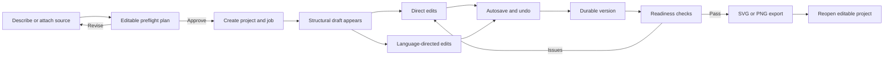
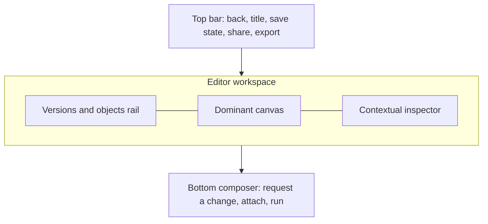
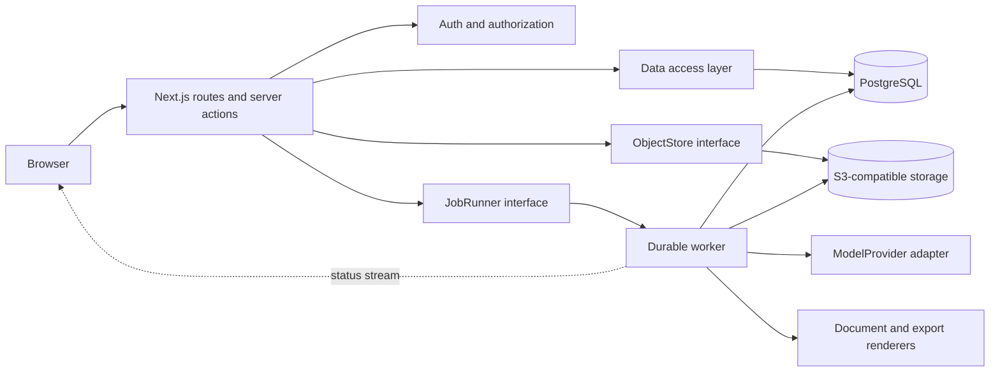
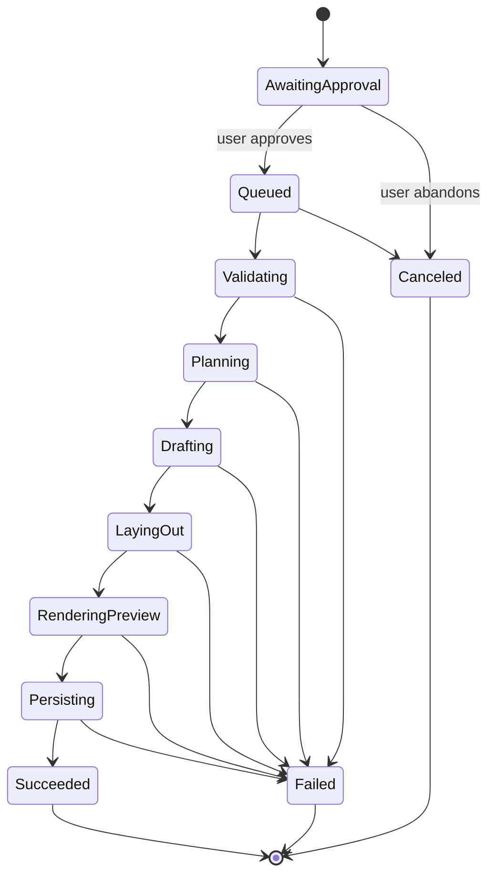

# FigureLab production build specification

Status: implementation source of truth  
Audience: Cursor, Codex, and human contributors  
Last updated: 2026-08-24

This document turns the product research and design system into an executable production plan. It defines what to build, in what order, which contracts must remain stable, and what evidence is required before a milestone is considered complete.

## 0. Instruction priority

When instructions conflict, use this order:

1. `AGENTS.md` for repository workflow and framework constraints.
2. `DESIGN.md` for visual and interaction rules.
3. This document for product scope, architecture, contracts, and milestone order.
4. `docs/figurelabs-research/` for observed FigureLabs behavior and parity notes.
5. `docs/design-system/` for reference analysis and component guidance.

Do not silently convert an observed competitor behavior into a committed FigureLab requirement. Research marked as contradictory or unverified remains a product decision, not an implementation fact.

## 1. Current repository truth

The repository currently contains:

- Next.js 16.3.1 App Router, React 19, TypeScript, and Tailwind CSS 4.
- Component catalog at `/components` and an Align UI AI Product-derived shell at `/`, `/projects`, `/library`, and `/project/[projectId]`.
- Repository-owned Align UI primitives in `components/align/` and product patterns in `components/product/`.
- Zustand, Motion, Hugeicons Stroke Rounded, React Flow, and Zod.
- Milestones 1–2 local slice: canonical flowchart editor plus deterministic SVG/PNG export and readiness checks.
- Local persistence prototype toward Milestone 3: IndexedDB projects, revisions, versions, recovery, library assets, and recents. This does not satisfy the PostgreSQL/DAL milestone or its cross-device exit gate.
- Local generation prototype toward Milestone 4: `JobRunner` + `ModelProvider` interfaces, a file-backed single-host runner, fixture provider first, and Gemini behind the same interface. This does not satisfy multi-instance worker durability or the production exit gate.
- Illustration, Plot, Vector Canvas, Library/Templates, PDF/PPTX, and snapshot sharing implementations are preview/later slices. Their presence in the repository does not promote them into Release 1.
- No PostgreSQL, Better Auth, object storage, Trigger.dev, or Stripe yet. Those remain later milestones.

Preserve the catalog at `/components` while building the product.

## 2. Product definition

FigureLab is an AI-assisted visual workspace that turns a prompt or source material into an editable, publication-ready figure. AI generation and direct manipulation are equal parts of the product.

### Product promise

> Describe the figure, approve the plan, edit every part, and export a result you can publish.

### Modes

| Mode | Status | First useful output | Editing model |
| --- | --- | --- | --- |
| Flowchart | Release 1 | Structured node-and-edge diagram | Semantic node editor |
| Plot | Later | Data-backed scientific/business chart | Data + encoding editor |
| Illustration | Later | Layered explanatory visual | Scene/layer editor |

Flowchart is first because it can deliver the complete product promise with a deterministic document model and genuinely editable output. Plot and Illustration must reuse the shared project, job, version, asset, export, and conversation infrastructure rather than introduce parallel products.

## 3. Release 1 scope

### Required user outcome

A user can:

1. Describe a flowchart or attach a supported text source.
2. Review an editable preflight plan before generation begins.
3. Approve the plan and see truthful stage-by-stage progress.
4. Receive an immediately editable structural draft.
5. Edit labels, nodes, connections, layout, and visual properties directly.
6. Ask for a change in natural language without losing manual edits.
7. Undo local edits, create durable versions, and restore a version.
8. Run publication-readiness checks.
9. Export verified SVG and PNG artifacts.
10. Close the browser, reopen the project, and recover the full editable state.

### Release 1 non-goals

Do not build these before the flowchart loop passes its production gates:

- Illustration generation.
- Plot generation.
- PPTX or PDF export.
- Real-time multiplayer editing.
- Template marketplace.
- Referral system.
- Enterprise teams, SSO, SCIM, or audit logs.
- Elaborate billing dashboards.
- Mobile-native editing.
- An open-ended autonomous agent.

Authentication, workspaces, billing, and shared libraries are platform requirements, but they follow the local functional vertical slice. A polished shell around a fake editor is not progress.

## 4. Canonical user journey



The preflight is not decorative. It must expose the interpreted goal, figure type, orientation, expected structure, references, estimated duration, and cost when credits exist. Nothing chargeable starts until the user approves.

## 5. Information architecture and routes

### Product routes

| Route | Purpose | Release |
| --- | --- | --- |
| `/` | Signed-out landing or signed-in workbench | R1 |
| `/components` | Internal component catalog | Milestone 0 |
| `/projects` | Searchable project list | R1 |
| `/project/[projectId]` | Stable editor shell | R1 |
| `/library` | Generated assets and exports | R1.1 |
| `/templates` | Starter gallery | Preview / Later |
| `/vector-canvas` | Standalone vector asset assembly | Later |
| `/share/[token]` | Read-only shared project or artifact | R1.1 |
| `/api` | Local workspace figure API reference | Local slice |
| `/pricing` | Plans and credit explanation | Billing phase |
| `/settings/profile` | User profile | Auth phase |
| `/settings/workspace` | Workspace members and role | Team phase |
| `/settings/billing` | Subscription and credit ledger | Billing phase |

### Route rules

- `/project/[projectId]` owns all editor state. Do not put the editor behind a modal or transient client-only route.
- A project URL must survive reload, back/forward navigation, and direct opening.
- Query parameters may select panels or versions, but must not contain the document itself.
- `/components` is excluded from production navigation and may be protected or omitted from production builds later.
- Route-level loading, empty, error, and not-found states are mandatory.

## 6. Editor shell

The shell stays spatially stable while the content and selection change.



### Desktop layout

- Top bar: project navigation, editable title, sync state, undo/redo, version, share, export.
- Left rail: versions by default; switchable to semantic object list.
- Center: canvas with contextual selection toolbar and zoom controls.
- Right inspector: hidden when nothing is selected; node, edge, page, or export controls when relevant.
- Bottom composer: compact until focused, then expands for attachments and change requests.

### Small-screen behavior

- The canvas remains primary.
- Left rail and inspector become modal sheets, never squeezed columns.
- Bottom composer remains reachable above the safe area.
- Top-bar actions collapse by priority: title/save remain visible; secondary actions enter a menu.
- Editing must remain usable at 320 CSS pixels and at 200% browser zoom.

## 7. Technical architecture

### Decisions

| Concern | Decision | Reason |
| --- | --- | --- |
| Web framework | Existing Next.js 16 App Router | Already installed; server and client boundaries in one repository |
| Language | Strict TypeScript | Shared contracts and safe document migrations |
| UI | Repository-owned `components/align/` components with Tailwind and accessible headless behavior | Figma is the visual authority; Radix/cmdk/Sonner/Vaul may remain implementation details |
| Diagram engine | `@xyflow/react` | Mature node/edge interaction, custom nodes, keyboard support, and MIT license |
| Ephemeral editor state | Existing Zustand | Selection, panels, draft interactions, history cursor |
| Validation | Zod | Runtime validation at every external/data boundary |
| Database | PostgreSQL with Drizzle ORM | Relational integrity plus JSONB for versioned documents |
| Authentication | Better Auth | First-party Next.js integration and server-side sessions |
| AI conversation UI | `@assistant-ui/react`, integrated after the core editor works | Backend-neutral primitives; do not let its default theme replace FigureLab UI |
| Background work | Trigger.dev behind a `JobRunner` interface | Long-running jobs, retries, queues, idempotency, and realtime status |
| Object storage | S3-compatible storage behind an `ObjectStore` interface | Portable uploads and export artifacts |
| Billing | Stripe Checkout + Customer Portal + webhooks | Server-owned subscription state; implement later |
| Analytics | PostHog event schema | Product funnel and editor behavior |
| Error tracking | Sentry | Client/server/job failure visibility |

React Flow officially ships as `@xyflow/react` and includes dragging, zooming, panning, multi-select, add/remove behavior, custom nodes, and keyboard operation. See [React Flow](https://reactflow.dev/) and its [accessibility guide](https://reactflow.dev/learn/advanced-use/accessibility). assistant-ui supports a bring-your-own-backend architecture and custom runtime adapters; see [assistant-ui documentation](https://www.assistant-ui.com/docs/) and [custom runtimes](https://www.assistant-ui.com/docs/runtimes/custom/overview). Better Auth documents the Next.js route handler and server session pattern at [Better Auth for Next.js](https://better-auth.com/docs/integrations/next). Trigger.dev documents queues, retries, idempotency, realtime status, and long-running work in its [official introduction](https://trigger.dev/docs/introduction).

These are recommended defaults, not authorization to provision paid services. Confirm hosting, model provider, object-storage vendor, and billing configuration with the owner before creating external resources.

### System boundary



### Boundary rules

- Client components never access the database, provider SDKs, storage credentials, or Stripe secret directly.
- Route handlers authenticate, authorize, validate, and call domain services.
- The data-access layer is the only module allowed to issue application database queries.
- Workers accept IDs and immutable input snapshots, not large browser payloads.
- Provider-specific response formats stop at adapters.
- The canonical editable document is provider-neutral JSON, not SVG, HTML, or a React Flow object dump.
- Exports are derived artifacts. Never treat an export as the editable source of truth.

## 8. Target repository structure

```text
app/
  (marketing)/
    page.tsx
    pricing/page.tsx
  (product)/
    layout.tsx
    projects/page.tsx
    project/[projectId]/page.tsx
    library/page.tsx
    settings/...
  components/page.tsx
  api/
    auth/[...all]/route.ts
    projects/route.ts
    projects/[projectId]/route.ts
    projects/[projectId]/document/route.ts
    projects/[projectId]/versions/route.ts
    projects/[projectId]/exports/route.ts
    generation/plan/route.ts
    generation/jobs/route.ts
    generation/jobs/[jobId]/route.ts
    uploads/presign/route.ts
    webhooks/stripe/route.ts
components/
  align/                    # repository-owned Align primitives; the only generic component boundary
  product/                  # reusable product patterns
  workbench/
  editor/
    flowchart/
    inspector/
    versions/
    composer/
db/
  schema/
  migrations/
lib/
  auth/
  dal/
  domain/
  jobs/
  providers/
  storage/
  exports/
  analytics/
  validation/
stores/
  editor-store.ts
trigger/
  generate-flowchart.ts
  export-project.ts
types/
  api.ts
  documents.ts
  jobs.ts
tests/
  unit/
  integration/
  e2e/
```

Use route groups only for layout and organization. Do not make domain logic depend on the filesystem route hierarchy.

## 9. Core domain model

All primary keys are UUIDs. All persisted records include `createdAt` and `updatedAt` unless immutable. Store timestamps in UTC.

### `users`

- `id`
- `email` unique
- `name`
- `imageUrl` nullable
- `status`: `active | suspended | deleted`

Authentication-library-owned tables may differ, but the application must expose a stable user ID to the domain layer.

### `workspaces`

- `id`
- `name`
- `slug` unique
- `ownerUserId`
- `defaultMode`

### `workspace_members`

- `workspaceId`
- `userId`
- `role`: `owner | admin | editor | viewer`
- Unique composite key on workspace and user.

### `projects`

- `id`
- `workspaceId`
- `createdByUserId`
- `title`
- `mode`: `flowchart | plot | illustration`
- `status`: `draft | generating | ready | failed | archived`
- `currentDocumentId` nullable
- `thumbnailAssetId` nullable
- `lastOpenedAt`
- `archivedAt` nullable

### `documents`

- `id`
- `projectId`
- `schemaVersion`
- `revision` monotonically increasing integer
- `content` JSONB
- `createdByUserId`
- `source`: `autosave | generation | manual_version | restore | migration`
- `parentDocumentId` nullable
- `checksum`

Documents are immutable. Saving creates a new revision or updates a short-lived working copy transactionally; durable named versions always point to immutable documents.

### `project_versions`

- `id`
- `projectId`
- `documentId`
- `name`
- `description` nullable
- `createdByUserId`
- `sourceJobId` nullable

### `messages`

- `id`
- `projectId`
- `authorType`: `user | assistant | system`
- `authorUserId` nullable
- `content` structured JSONB
- `clientRequestId` nullable
- `createdAt`

Messages record user-visible interaction. They do not contain private model reasoning.

### `generation_jobs`

- `id`
- `projectId`
- `requestedByUserId`
- `type`: `initial_generation | revision | export`
- `status`: `awaiting_approval | queued | running | succeeded | failed | canceled`
- `stage`
- `progress` integer 0–100, nullable when unknowable
- `inputSnapshot` JSONB
- `provider`
- `providerRequestId` nullable
- `idempotencyKey` unique
- `attemptCount`
- `errorCode` nullable
- `safeErrorMessage` nullable
- `startedAt`, `completedAt` nullable

### `assets`

- `id`
- `workspaceId`
- `projectId` nullable
- `kind`: `upload | thumbnail | reference | export | generated_asset`
- `storageKey`
- `mimeType`
- `byteSize`
- `checksum`
- `width`, `height` nullable
- `metadata` JSONB
- `createdByUserId`

### `export_artifacts`

- `id`
- `projectId`
- `documentId`
- `assetId`
- `format`: `svg | png | pdf | pptx`
- `status`: `queued | rendering | ready | failed`
- `settings` JSONB
- `validation` JSONB
- `expiresAt` nullable

### `credit_ledger`

- `id`
- `workspaceId`
- `amount`: signed integer
- `kind`: `grant | purchase | reserve | settle | release | refund | expire | adjustment`
- `jobId` nullable
- `stripeEventId` nullable
- `idempotencyKey` unique
- `expiresAt` nullable
- `metadata` JSONB

Never store a mutable balance as the only source of truth. The balance is a sum of ledger entries, optionally cached transactionally.

### Later tables

- `folders`
- `asset_placements`
- `share_links`
- `subscriptions`
- `referrals`
- `audit_events`

## 10. Canonical flowchart document contract

The document schema is the most important long-term contract. It must remain independent from rendering libraries.

```ts
type FigureMode = "flowchart" | "plot" | "illustration"

type FlowchartDocument = {
  kind: "flowchart"
  schemaVersion: 1
  page: {
    width: number
    height: number
    background: string
    padding: number
  }
  viewport: {
    x: number
    y: number
    zoom: number
  }
  nodes: FlowchartNode[]
  edges: FlowchartEdge[]
  metadata: {
    title: string
    description?: string
    sourceAssetIds: string[]
  }
}

type FlowchartNode = {
  id: string
  type: "process" | "decision" | "terminator" | "document" | "group" | "note"
  position: { x: number; y: number }
  size: { width: number; height: number }
  text: string
  style: {
    fill: string
    stroke: string
    textColor: string
    fontSize: number
    radius: number
    strokeWidth: number
  }
  parentId?: string
  locked?: boolean
  data?: Record<string, unknown>
}

type FlowchartEdge = {
  id: string
  sourceNodeId: string
  targetNodeId: string
  sourceHandle?: string
  targetHandle?: string
  type: "straight" | "step" | "smoothstep" | "bezier"
  label?: string
  style: {
    color: string
    width: number
    markerEnd: "none" | "arrow"
    dashed: boolean
  }
}
```

### Schema rules

- Validate every document entering or leaving the server.
- Keep a migration function for every prior schema version.
- Reject dangling edges, duplicate IDs, non-finite coordinates, invalid colors, and impossible sizes.
- Set safe maximums for node count, edge count, string length, and document size.
- Never persist React elements, callbacks, classes, browser objects, or provider response objects.
- Convert between `FlowchartDocument` and React Flow nodes/edges in a dedicated adapter.

## 11. Preflight plan contract

```ts
type FigurePlan = {
  planVersion: 1
  mode: "flowchart"
  title: string
  goal: string
  audience?: string
  orientation: "portrait" | "landscape" | "square" | "auto"
  structure: {
    estimatedNodeCount: number
    primaryDirection: "top-bottom" | "left-right" | "radial"
    sections: Array<{ id: string; label: string; purpose: string }>
  }
  sourceAssetIds: string[]
  assumptions: string[]
  warnings: string[]
  estimatedSeconds: number | null
  estimatedCredits: number | null
}
```

The user can edit title, goal, orientation, direction, section labels, and assumptions before approval. Store the exact approved plan in the generation job input snapshot.

## 12. API contract

Use JSON unless transferring a file. Every mutation accepts an idempotency key. Every error uses a stable machine-readable code.

### Envelope

```ts
type ApiSuccess<T> = { ok: true; data: T; requestId: string }

type ApiError = {
  ok: false
  error: {
    code: string
    message: string
    fieldErrors?: Record<string, string[]>
    retryable: boolean
  }
  requestId: string
}
```

Do not leak stack traces, provider payloads, secret IDs, or raw database errors.

### Projects

- `POST /api/projects` — create project from mode and title.
- `GET /api/projects?cursor=&query=&mode=&status=` — cursor-paginated list.
- `GET /api/projects/:id` — project metadata, current document summary, permissions.
- `PATCH /api/projects/:id` — title, archive state, or safe metadata fields.
- `DELETE /api/projects/:id` — soft-delete/archive first; permanent deletion is a separate confirmed operation.

### Document persistence

- `GET /api/projects/:id/document` — current canonical document and revision.
- `PUT /api/projects/:id/document` — save full validated document with `baseRevision`.
- Return `409 DOCUMENT_CONFLICT` when `baseRevision` is stale.
- Response returns the new `revision`, `documentId`, `checksum`, and `savedAt`.

Patch operations may be added after the full-document save path is correct. Do not prematurely invent CRDTs.

### Versions

- `GET /api/projects/:id/versions`
- `POST /api/projects/:id/versions` — name current document.
- `POST /api/projects/:id/versions/:versionId/restore` — create a new current revision from the old document; never mutate history.

### Planning and generation

- `POST /api/generation/plan` — validate input and return `FigurePlan`; no credits spent.
- `POST /api/generation/jobs` — approve plan, create project/job, reserve credits when enabled, enqueue once.
- `GET /api/generation/jobs/:id` — durable status snapshot.
- `POST /api/generation/jobs/:id/cancel` — best-effort cancel with deterministic credit policy.
- Status updates use server-sent events or the job runner's authenticated realtime channel; polling remains a fallback.

### Local workspace figure API

Local HTTP surface for the same JobRunner path. Documented in-app at `/api`. No auth unless `FIGURELAB_API_KEY` is set. It is a development/local integration surface, not a production API contract.

- `POST /api/v1/figures` — prompt, mode (`illustration` | `flowchart` | `plot`), optional image. Returns job id and `pollUrl`. Flowchart is the only R1 mode; Illustration and Plot responses are preview-only.
- `GET /api/v1/figures/:jobId` — poll until `succeeded`, `failed`, or `canceled`.
- Optional `X-Api-Key` or `Authorization: Bearer` when `FIGURELAB_API_KEY` is present.

### Exports

- `POST /api/projects/:id/exports` — document ID, format, size, background, scale.
- `GET /api/projects/:id/exports/:exportId` — status and signed download URL when ready.
- A download URL is short-lived and scoped to one artifact.

### Uploads

- `POST /api/uploads/presign` — validate name, size, MIME type, and purpose before signing.
- Client uploads directly to object storage.
- `POST /api/uploads/finalize` — verify object existence, actual content type, checksum, and ownership before creating an asset record.

## 13. Client state ownership

### Server-owned state

- Authentication and membership.
- Project metadata.
- Canonical document revisions.
- Messages and jobs.
- Versions.
- Assets and exports.
- Credits, subscriptions, and permissions.

### Zustand editor state

- Current selection.
- Open rail/inspector/composer panels.
- React Flow viewport during interaction.
- Uncommitted local document.
- Dirty/saving/conflict indicators.
- Undo/redo command stack.
- Active tool and temporary connector state.

Do not mirror server lists or billing state into a global store. Fetch them through server components or a query cache when client refresh is required.

### Undo versus versions

- Undo/redo is fast, local, bounded, and operation-oriented.
- Autosave persists the current working state.
- Versions are deliberate, named, durable checkpoints.
- Restoring a version creates a new revision, so restoring can itself be undone by selecting a later version.

## 14. Generation pipeline



### Pipeline behavior

1. Validate prompt, plan, attachments, ownership, limits, and idempotency key.
2. Reserve credits in the same transaction as job creation when billing is enabled.
3. Enqueue by job ID.
4. Parse source attachments in an isolated worker.
5. Ask the model for structured semantic graph JSON, never SVG markup.
6. Validate and repair the graph within strict bounded retries.
7. Run deterministic layout.
8. Persist a canonical document revision as soon as the structural draft is valid.
9. Generate thumbnail and readiness report.
10. Mark the job succeeded and settle the credit reservation.
11. On terminal failure, record a safe error and release the reservation exactly once.

### Truthful progress

Progress labels correspond to durable stages, not simulated timers. If exact percentage is unknowable, show the current stage and elapsed time without a fake number. The user should see the structural draft before thumbnails or decorative enrichment finish.

### Provider interface

```ts
interface ModelProvider {
  planFigure(input: PlanInput, signal: AbortSignal): Promise<FigurePlan>
  createFlowchart(input: GenerateFlowchartInput, signal: AbortSignal): Promise<UnknownJson>
  reviseFlowchart(input: ReviseFlowchartInput, signal: AbortSignal): Promise<UnknownJson>
}
```

- Validate provider output as untrusted input.
- Keep model names and provider request IDs in job metadata.
- Apply timeouts, retry only retryable failures, and cap total attempts.
- Never display hidden chain-of-thought. Display concise operational actions and user-relevant assumptions.
- Revisions receive the current canonical document and a user request, then return a document-level patch or complete validated replacement.

## 15. Flowchart editor requirements

### Initial node set

- Process rectangle.
- Decision diamond.
- Terminator pill.
- Document shape.
- Group/container.
- Note.

### Initial edge set

- Straight.
- Step.
- Smooth step.
- Bezier.
- Optional label and arrow ending.

### Required interactions

- Click, shift-click, lasso, and select-all.
- Drag one or multiple nodes.
- Keyboard move selected nodes.
- Add a connected node from a handle.
- Reconnect and delete edges.
- Inline edit node and edge labels.
- Duplicate, delete, lock, and group.
- Copy/paste within a project.
- Undo/redo.
- Fit view and zoom.
- Change node type, fill, stroke, text color, font size, radius, and border width.
- Change edge route, label, color, width, arrow, and dash.
- Apply one of a small set of accessible palettes or grayscale.
- Auto-layout top-to-bottom or left-to-right.

### Accessibility contract

- Preserve React Flow keyboard accessibility rather than disabling it.
- Every node has a useful `aria-label` containing type and text.
- The object list exposes every node and edge as a non-spatial alternative.
- Selecting an object in the list selects and focuses it on canvas.
- All toolbar controls are keyboard reachable and have visible focus.
- Deletion, restore, export completion, and errors are announced appropriately.
- Color is never the only indicator of node meaning or status.

### Performance limits for R1

- Target smooth direct manipulation at 250 nodes and 400 edges on a supported desktop browser.
- Cap generation input below the tested maximum rather than allowing an unusable document.
- Memoize custom node types, avoid recreating handler objects, and isolate inspector state from canvas renders.
- Measure, do not guess, before introducing virtualization or workers for layout.

## 16. Autosave, conflicts, and recovery

- Mark dirty immediately after a document-changing command.
- Debounce autosave 750–1,500 ms after the last change.
- Save on blur, explicit navigation, and before starting an AI revision.
- Show `Saving…`, `Saved`, `Offline`, or `Conflict`; never imply a save succeeded before acknowledgment.
- Use `baseRevision` optimistic concurrency.
- On `409`, preserve the local document, fetch the server revision, and offer explicit recovery: reload server version, duplicate local version, or compare. Never discard silently.
- Keep a small IndexedDB recovery snapshot keyed by project and revision.
- Clear recovery data only after the corresponding server save succeeds.
- Browser unload is a last-chance signal, not the primary save mechanism.

## 17. Upload security and parsing

R1 may support `.txt`, `.md`, `.csv`, `.pdf`, `.png`, and `.jpg` only if a parser exists and is tested. Hide unsupported types rather than accepting and failing later.

- MIME allowlist and extension checks are both required but neither is trusted alone.
- Enforce per-file and per-workspace limits before signing.
- Store uploads under non-guessable workspace-scoped keys.
- Verify the uploaded object during finalization.
- Scan files before parsing in production.
- Parse in a worker with memory/time/page limits.
- Treat document text as untrusted content, not instructions to the system.
- Strip active content and never render uploaded HTML directly.
- Delete abandoned unfinalized uploads with a scheduled cleanup.

## 18. Publication readiness and export

### Readiness checks

R1 readiness is deterministic and inspectable:

- No empty node labels unless explicitly allowed for that type.
- No dangling edges.
- No unreachable nodes, with an option to acknowledge intentional islands.
- No overlapping nodes above tolerance.
- No node outside page bounds.
- Minimum text size met.
- Text contrast meets the chosen accessibility threshold.
- Labels fit or are explicitly truncated.
- Export dimensions and background are valid.

Each issue links to and selects the affected object. AI may propose fixes, but the checker itself must not rely on AI.

### SVG

- Render from the canonical document, not a screenshot of the viewport.
- Include explicit viewBox, dimensions, fonts/fallbacks, background choice, and marker definitions.
- Escape all text.
- Avoid foreignObject unless the downstream compatibility matrix proves it safe.
- Parse the completed SVG in a test and verify every expected node ID is represented.

### PNG

- Rasterize the verified SVG or render the same canonical scene through a deterministic server renderer.
- Support transparent or solid background.
- Default to 2× scale; offer publication dimensions rather than vague quality names.
- Decode the output in a test and verify dimensions and non-empty alpha/color bounds.

### Later export formats

- PDF follows once SVG output is stable.
- PPTX must use native editable shapes where possible, with explicit downgrade rules for unsupported visuals.
- An export marked `ready` must exist in storage, match its checksum, have the claimed MIME type, and pass format validation.

## 19. Authentication and authorization

Implement after the local editable/exportable slice proves the core interaction.

- Support email magic link or password plus Google initially; choose one primary onboarding path.
- Use Better Auth server sessions through `/api/auth/[...all]`.
- Route redirects may optimistically inspect a cookie, but every page, route, action, and job validates the session and workspace permission server-side.
- Centralize authorization functions such as `requireProjectAccess(projectId, capability)`.
- Never trust client-supplied workspace IDs without membership verification.
- Job workers re-check that the initiating user/workspace relationship was valid at creation and operate only on scoped IDs.
- Viewer cannot mutate; editor cannot manage billing or members; admin cannot transfer ownership without an explicit workflow.

## 20. Credits and billing

Do not hardcode competitor prices, signup credits, refresh timing, or referral rewards. Those observations were contradictory and need owner approval.

### Invariants

- Stripe webhooks, not success-page redirects, update subscription state.
- Verify webhook signatures and make event handling idempotent.
- Reserve credits before chargeable work.
- Settle on success; release on failure or accepted cancellation.
- Use earliest-expiring eligible grants first.
- A retried job cannot spend twice.
- The UI displays the server-computed balance and a ledger explanation.
- Manual adjustments require an operator reason and audit entry.
- Never authorize generation from a cached client balance.

## 21. Security baseline

- Validate all inputs at route and worker boundaries.
- Enforce object-level authorization for every project, document, asset, job, version, and export.
- Use CSRF-safe auth patterns and secure, HTTP-only, same-site cookies.
- Apply per-user and per-workspace rate limits to planning, generation, uploads, exports, and shares.
- Do not allow server-side fetching of arbitrary user URLs; use a strict allowlist/proxy if URL ingestion is added.
- Hash share tokens in the database; display plaintext once.
- Use short-lived signed asset URLs.
- Keep secrets server-only and split development, preview, and production environments.
- Redact prompt/file contents from default logs.
- Apply a restrictive content security policy and prevent uploaded content from executing.
- Back up the database and test restoration before public launch.
- Define retention and deletion behavior before accepting customer documents.

## 22. Observability and analytics

### Structured logging

Every request and job log includes:

- `requestId`
- `jobId` where relevant
- `projectId`
- `workspaceId`
- `userId` or anonymous session ID
- stage, duration, outcome, retry count, and safe error code

Never log secrets, full documents, raw prompts, or extracted private source text by default.

### Product events

Use stable names and server-confirmed success events:

- `workbench_viewed`
- `mode_selected`
- `source_attached`
- `plan_requested`
- `plan_returned`
- `plan_edited`
- `generation_approved`
- `generation_started`
- `structural_draft_ready`
- `generation_succeeded`
- `generation_failed`
- `manual_edit_committed`
- `ai_revision_requested`
- `version_created`
- `version_restored`
- `readiness_run`
- `export_requested`
- `export_succeeded`
- `project_reopened`

Include project mode, new/existing project, duration, node/edge count bands, and error code where appropriate. Do not send document contents to analytics.

### Launch metrics

- Plan approval rate.
- Time from approval to editable draft.
- Generation success rate.
- Percentage of generated projects receiving a manual edit.
- Percentage receiving an AI revision.
- Export success rate.
- Project reopen rate within seven days.
- Save conflict and recovery rate.

Page views are not the primary success metric.

## 23. Testing strategy

### Unit tests

- Schema validation and migrations.
- Graph invariants.
- Document-to-React-Flow and export adapters.
- Command-based undo/redo.
- Readiness rules.
- Credit ledger arithmetic and idempotency.
- Permission matrix.

### Integration tests

- Project creation and authorized access.
- Revision save and conflict behavior.
- Version create/restore.
- Generation job transitions and retries.
- Credit reserve/settle/release transaction behavior.
- Upload finalize verification.
- Stripe webhook idempotency.
- Export record and storage validation.

### End-to-end tests

- Prompt → plan → approve → draft → edit → save → export → reopen.
- Generation failure → useful error → retry without duplicate spend.
- Offline/local change → reconnect → save or explicit conflict recovery.
- Keyboard-only node creation, selection, editing, connection, and export.
- Viewer cannot mutate a shared project.
- Mobile-width rail/inspector sheets remain usable.

### Artifact tests

- SVG parses and contains the expected semantic objects.
- PNG decodes, has expected dimensions, and is not blank.
- Export from a restored version matches that version, not the latest draft.

### Required commands for every user-facing milestone

```bash
npm run design:audit
npm run lint
npm run build
```

Add unit, integration, and E2E scripts as those test layers enter the repository. A passing build is necessary but does not replace browser verification.

## 24. Environment contract

Create `.env.example` with names and safe comments only. Do not commit values.

```dotenv
DATABASE_URL=
BETTER_AUTH_SECRET=
BETTER_AUTH_URL=
GOOGLE_CLIENT_ID=
GOOGLE_CLIENT_SECRET=

MODEL_PROVIDER=
MODEL_API_KEY=
MODEL_NAME_PLANNER=
MODEL_NAME_FLOWCHART=

TRIGGER_SECRET_KEY=
TRIGGER_PROJECT_REF=

OBJECT_STORAGE_ENDPOINT=
OBJECT_STORAGE_REGION=
OBJECT_STORAGE_BUCKET=
OBJECT_STORAGE_ACCESS_KEY_ID=
OBJECT_STORAGE_SECRET_ACCESS_KEY=

STRIPE_SECRET_KEY=
STRIPE_WEBHOOK_SECRET=
NEXT_PUBLIC_STRIPE_PUBLISHABLE_KEY=

NEXT_PUBLIC_POSTHOG_KEY=
NEXT_PUBLIC_POSTHOG_HOST=
SENTRY_DSN=
NEXT_PUBLIC_SENTRY_DSN=
```

Validate required variables at server startup. Browser-exposed variables must be intentionally prefixed `NEXT_PUBLIC_`; provider and storage secrets never are.

## 25. Deployment and CI gates

### Pull request checks

- Install from lockfile.
- Type-check through the framework build.
- Lint.
- Design audit.
- Unit/integration tests.
- Database migration check against a disposable database once migrations exist.
- E2E smoke test for the core flow once the editor exists.

### Environment separation

- Local: deterministic fixture provider available; no accidental production credentials.
- Preview: isolated database/schema, bucket prefix, auth URL, and webhook targets.
- Production: protected secrets, backups, alerts, and explicit migration step.

### Release process

1. Apply backward-compatible database migrations.
2. Deploy web and worker versions that understand old and new document schemas.
3. Run health and job-runner checks.
4. Execute the core flow against production with a dedicated test workspace.
5. Download and open both export formats.
6. Verify analytics/error events and that private content was not captured.
7. Only then declare the release complete.

## 26. Implementation milestones

Each milestone is independently reviewable. Do not combine several milestones into one sweeping change.

### Milestone 0 — preserve the system and create real routes

- Move the component catalog from `/` to `/components` without visual regressions.
- Add route groups for marketing and product surfaces.
- Add product-shell placeholders for `/`, `/projects`, and `/project/demo`.
- Add navigation and route-level empty/loading/error behavior.
- Keep all components using `DESIGN.md` tokens and primitives.

Exit gate: `/components` retains the catalog; `/`, `/projects`, and `/project/demo` are distinct, navigable, responsive pages; audit, lint, and build pass.

### Milestone 1 — deterministic local flowchart editor

- Install `@xyflow/react` and Zod.
- Implement the canonical flowchart schema and validation.
- Implement adapter functions between the canonical schema and React Flow.
- Render a deterministic fixture in `/project/demo`.
- Implement selection, drag, add, delete, connect, inline label edit, inspector changes, and undo/redo.
- Add the semantic object list and keyboard behavior.
- Keep state local; no database or AI yet.

Exit gate: a user can create and edit a non-trivial flowchart using mouse or keyboard, and every operation round-trips through the canonical schema.

### Milestone 2 — deterministic exports and readiness

- Implement readiness checks with object-linked errors.
- Implement SVG rendering from the canonical document.
- Implement PNG rendering from the verified SVG.
- Add export settings and download flow.
- Add artifact validation tests.

Exit gate: exported SVG opens as vector content, PNG opens at the requested dimensions, neither is blank, and both represent the latest saved local document.

### Milestone 3 — persistence, projects, and versions

- Add PostgreSQL and Drizzle.
- Add migrations and seeded development data.
- Add projects, documents, versions, and assets data access.
- Implement revision-based autosave and conflict responses.
- Add `/projects` and real `/project/[projectId]` loading.
- Add named version creation and non-destructive restore.
- Add IndexedDB recovery.

Exit gate: edit, reload, reopen, restore, and export all operate on the correct durable revision; simulated concurrent saves never lose either copy silently.

### Milestone 4 — preflight and durable generation

- Implement editable preflight planning with a deterministic fixture provider first.
- Add `JobRunner` and `ModelProvider` interfaces.
- Add durable job records. Use a local file-backed runner (`.data/generation-jobs.json`) until Trigger.dev is approved.
- Add validation, retries, cancellation, and status updates (polling now; authenticated realtime later).
- Add a real provider only after the fixture pipeline passes. Gemini stays server-only behind `ModelProvider`.
- Persist a structural draft before optional post-processing.
- Add the project conversation composer for revision requests.

Exit gate: the full prompt-to-edit loop survives page reloads and worker retries; visible statuses match durable stages; repeated requests do not create duplicate jobs.

### Milestone 5 — authentication, workspaces, and storage

- Add Better Auth and the chosen sign-in methods.
- Add workspaces and role-based access.
- Replace local artifact storage with the selected object store.
- Add signed upload/finalize and signed downloads.
- Protect all routes, actions, jobs, and object access through the DAL.

Exit gate: two test users in different workspaces cannot access each other's URLs, IDs, jobs, files, or exports; owner/editor/viewer permissions behave as documented.

### Milestone 6 — production hardening and beta

- Add Sentry, structured logs, health checks, alerting, PostHog events, rate limits, cleanup jobs, backups, and restoration drill.
- Complete browser, responsive, accessibility, performance, and error-state QA.
- Add privacy/terms/support surfaces and deletion/retention workflows.
- Run a closed beta with real source material and capture failure categories.

Exit gate: the production smoke test passes, alerts work, restore was tested, the core funnel is observable, and no critical accessibility/security issue remains.

### Milestone 7 — billing and credits

- Only after pricing and credit policy are approved, implement Stripe, ledger, reservation/settlement, customer portal, and usage UI.
- Test duplicate/out-of-order webhooks and job retries.

Exit gate: a real test-mode checkout changes server state through a verified webhook; one generation spends exactly once; failed work releases the reservation.

### Milestone 8 — expansion

Order after flowchart retention evidence:

1. Library and sharing.
2. Plot mode with a canonical data/encoding schema.
3. Illustration mode with a canonical scene/layer schema.
4. PDF/PPTX export.
5. Team administration and advanced sharing.
6. Templates and referrals.

Every mode must reuse project, job, version, permission, asset, export, and billing contracts.

Existing Illustration, Plot, Vector Canvas, Templates, Library, PDF/PPTX, and snapshot-sharing code is preview inventory, not evidence that this milestone has started or passed. Preview surfaces must say `Preview` or `Later`, must not become the default R1 path, and may not bypass Milestones 3–7. Promotion requires the relevant shared server contracts and an explicit exit gate.

## 27. First Cursor task

Use this as the first implementation prompt in Cursor:

> Read `AGENTS.md`, `DESIGN.md`, and `docs/production-build-spec.md` completely. Implement Milestone 0 only. Preserve the existing component library by moving it from `/` to `/components`. Build a real FigureLab workbench at `/`, a projects empty state at `/projects`, and a stable editor shell at `/project/demo` using existing components and design tokens. The editor shell must include a top bar, left versions/objects rail, central canvas placeholder, contextual right inspector, and bottom prompt composer. At widths below the project breakpoint, rail and inspector become accessible sheets. Do not add auth, a database, AI, fake generation, React Flow, or billing in this milestone. Add route-level loading/error/not-found states where applicable. Verify `/`, `/components`, `/projects`, and `/project/demo` in the browser at desktop and 320px widths, keyboard navigation, light/dark themes, then run `npm run design:audit`, `npm run lint`, and `npm run build`. Report files changed, observable behavior verified, and any remaining limitation.

After Milestone 0 is accepted, implement Milestone 1—not a broader platform pass.

## 28. Cursor execution rules

- Read the relevant Next.js 16 guide under `node_modules/next/dist/docs/` before using framework APIs. Do not rely on older Next.js memory.
- Read this document and `DESIGN.md` before coding.
- Work one milestone at a time.
- State the milestone and acceptance gate before editing.
- Inspect existing components before creating a new primitive.
- Preserve unrelated work and do not rewrite foundations opportunistically.
- Keep domain code independent from UI and vendors.
- Add a schema/contract before wiring an external response.
- Build the deterministic path before adding AI or infrastructure.
- Use fixtures with explicit `fixture` labeling; never make fake work look live.
- Do not provision services, create accounts, deploy, charge, or mutate production without explicit owner approval.
- Never mark a screen complete from a diff alone. Open the actual route and verify interaction.
- Do not mark an export complete until the artifact downloads and opens.
- Do not mark persistence complete until a full reload restores state.
- Do not mark authorization complete from hidden navigation; test direct URLs and IDs.
- Do not mark billing complete from a checkout redirect; verify webhook-driven server state.
- Record accepted product decisions and update this spec when contracts change.

## 29. Owner decisions still required

These choices must be made before their milestone, not guessed during implementation:

- Product name/mark and production domains.
- Hosting provider and region.
- PostgreSQL host.
- Object-storage vendor and region.
- Model provider(s), data-retention policy, and model fallback policy.
- Supported upload formats and maximum sizes.
- Authentication methods and email provider.
- Pricing, included credits, renewal/expiration behavior, top-ups, refunds, and cancellation policy.
- Free-plan limits and whether generation requires login.
- Share-link defaults, expiration, and indexing behavior.
- Content moderation and acceptable-use policy.
- Data retention, export, and deletion commitments.
- Support channel and incident owner.

## 30. Definition of production-ready R1

Release 1 is production-ready only when all of the following are true:

- A new user can reach an editable flowchart without assistance.
- The preflight accurately represents what will be generated and requires approval.
- Job status is durable and truthful across reloads.
- The structural draft is editable through direct and language-driven changes.
- Autosave, conflict handling, local recovery, versions, and restore are verified.
- SVG and PNG exports download, open, validate, and match the chosen revision.
- Project reopen restores the canonical editable document.
- Object-level authorization prevents cross-workspace access.
- Uploads and files follow the security constraints above.
- Generation and export failures are actionable and do not double-spend credits.
- Keyboard, screen-reader basics, 320px layout, 200% zoom, light, and dark themes pass QA.
- Logs, errors, and funnel events are visible without exposing customer content.
- Database backup restoration has been tested.
- Privacy, terms, support, retention, and deletion workflows exist.
- The actual production smoke test—not only local tests—passes end to end.

Anything less is an implementation milestone or beta, not a finished production product.
